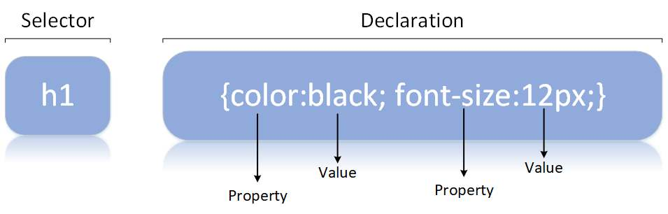
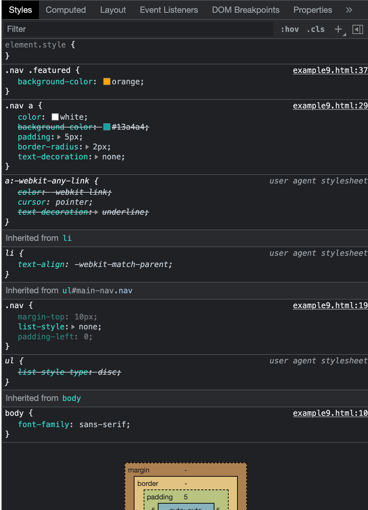
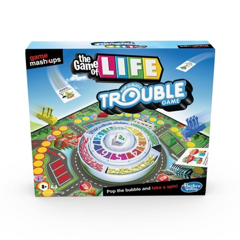

# Chapter 1 Cascade, specificity, and inheritance

## Of the following what are required?

1. HTML
2. CSS
3. JavaScript

### What is HTML responsible for?

- structure

### What is CSS responsible for?

- style

### What is JavaScript responsible for?

- functionality

## What are the 3 ways to add CSS to an html page

1. inline-style
2. style section of HTML head element
3. external stylesheet

## 1. inline-style

- style attribute used on an HTML tag

```html
<!-- inline-styles should not be used -->
<div style="color: black; font-size: 12px;"></div>
```

### parts of an inline-style

property
: what want to style (eg. background-color or height)

value
: how want to style it (eg. red or 100vh)

### what's wrong with inline-styles?

- can't be reused as applied directly to HTML tag

## 2. style section of HTML head element

```html
<html>
  <head>
    div { color: black; font-size: 12px; /* unit should actually be rem */ }
  </head>
</html>
```

### what part is added for style section of HTMl head element?

selector
: what part of the DOM do you want to style?

## 3. external stylesheet

```css
<link rel="stylesheet" href="styles/main.css" />
```

### Why are external stylesheets recommended?

1. Clear separation of HTML and CSS
2. When lots of properties hard to read if in the HTML head section
3. Can reuse external stylesheet on different HTML pages
4. The external stylesheet can be cached

**_NOTE_** for the course the style tag will be primarily used but that is for demo purposes

## Parts of a CSS ruleset



Selector
: what part of DOM do you want to style

Property
: what you want to style

Value
: how you want to style it

```css
h1 {
  color: black;
  font-size: 12px; /* should be rem */
}
```

## creating an HTML page in VSCode

- type html and select html:5

[example1.html](example1.html)

## "Cascading" Style Sheets (CSS)

### Why is the cascade so important?

Cascade
: resolves which value "wins" when multiple values can be used for a property

Cascaded Value
: The value that "wins" the cascade having the highest precedence, at most one and may not be a value if property value not provided in any ruleset

## 3 ways the cascade resolves conflicts

### Stylesheet **origin**

1.  Author important **NOT RECOMMENDED**

    ```css
    font-family: serif !important;
    ```

2.  Author
3.  User Agent

    - Example 1
    - Example 2

Author styles
: override user agent styles higher priority

User agent styles
: ex. chrome://settings Appearance

- h1 to h6 and p top and bottom margin
- ol and ul left padding
- link colors
- default fonts and sizes

### **_Specificity_** some styles more specific than others

1. **inline** style attribute

```html
<div style="background-color: blue;"></div>
```

- Selectors appear in all rule sets except inline styles

- If inline style marked important nothing can override them

**NOT RECOMMENDED need to override with Author important !**

- If creating an npm package of components make sure not to have inline styles otherwise whomever uses the component will have to use !important to override styling
- Example 3

2. **Style element**

```html
<head>
  <style>
    .example {
      background-color: blue;
    }
  </style>
</head>

<body>
  <div class="example"></div>
</body>
```

1. **Link element** external .css stylesheet

   - preferred for browser caching as can use across pages

```html
<head>
  <link rel="stylesheet" href="styles.css" />
</head>
```

##### Types of selectors in order of specificity

- a single id has a higher specificity than any number of classes

1. id selectors (#) **NOT RECOMMENDED**

   - when used end up having to copy the selector and add a class to it

2. class selectors (.)

- pseudo-class selectors (:hover)
- attribute selectors (type["input"])

1. tag selectors (div)

universal selector (\*)
: very weak and has no affect on specificity

- also combinators (>, +, - ) have no effect on specificity

```css
html body header h1 {
  color: blue;
}

body header.page-header h1 {
  color: orange;
}

.page-header .title {
  color: green;
}

#page-title {
  color: red;
}
```

| Inline | # ids | . class | tag | notation              |
| ------ | ----- | ------- | --- | --------------------- |
|        |       |         | 4   | 0,0,0,4               |
|        |       | 1       | 3   | 0,0,1,3               |
|        |       | 2       |     | 0,0,2,0               |
|        | 1     |         |     | 0,1,0,0 most specific |

- We can simplify by not using inline styles or #ids

  - then we simply count 2 selectors beat 1 selector

| . classes | tags |
| --------- | ---- |
|           |      |

- Example 4
- Example 5
- Example 6

### **Source Order**

- If comes later takes precedence, considered after origin and specificity

* Example 7

### **LoVe HAte**


- an example where source order matters, as psuedo classes have the same specificity, :link, :visited, :hover, :active, should be in LoVe HAte source order

- user Hovers over a Visited link Hover style takes precedence
- if user Activates the Link while Hovering over it then Active style takes precedence

* Example 8

## Inheritance - last way an element can receive styles


- inheritance values are passed down until overridden by cascaded value

### inherited properties

- text
  - color
  - font
  - font-family
  - font-size
  - font-weight
  - font-variant
  - font-style
  - line-height
  - letter-spacing
  - text-align
  - text-indent
  - text-transform
  - white-space
  - word-spacing
- list
  - list-style
  - list-style-type
  - list-style-position
  - list-style-image
- table borders
  - border-collapse
  - border-spacing

* Example 9

- DevTools display Cascaded Styles at top and inherited values on bottom
  - they are listed in the order of precedence

element.style
: inline styles



---

## Cascade

1. Origin (Author Important, Author, User Agent)
2. Specificity
3. Inheritance

- Example #9

---

## Selectors

### Basic

**tag selectors** - specificity 0, 0, 1
: body, a

- good for basic styling such as body and anchor tags, otherwise classes preferred

**.class selectors** - specificity 0, 1, 0
: target elements with a particular class name

- always a good idea even when only one element will have class

**#id selectors** - specificity 1, 0, 0
: target element with a particular id

- **NOT RECOMMENDED** - where classes only used for css ids have other purposes
- also increases the complexity of thinking about complexity

```html
<!-- An HTML feature links with # can link to sections of the page -->
<nav>
  <a href="#intro" class="active">Intro</a>
  <a href="#outro">Outro</a>
</nav>
<section id="intro" class="main-section highlighted">
  <p>This is the intro section.</p>
</section>
<section id="outro" class="main-section">
  <p>This is the outro section.</p>
</section>
```

**_"\*"_** universal selector\*\* - specificity 0, 0, 0
: targets all elements but very low specificity

---

## Compound Selectors (vs. Simple Selectors)

**compound selector** .dropdown.is-active
: targets elements that match all its simple selectors

```html
<style>
  /* compound selector */
  /* if a space between .dropdown .is-active 
    would be a descendant selector and
    target any element under .dropdown 
    with class is-active */
  .dropdown.is-active {
    color: green;
  }
</style>
<!-- compound selector -->
<!-- targets this -->
<div class="dropdown is-active">Styled</div>
<!-- but not this -->
<div class="dropdown">
  <span class="is-active">Not Styled</span>
</div>
```

**_NOTE_** compound selectors like descendant combinators provide the another way to add more info so create more precedence

---

## Combinators

- combine multiple selectors

#### descendant vs direct descendant combinators

**descendant combinator**
: div p

- has a space
- p can be nested at any depth under div
- the most commonly used combinator
- can have multiple div p span

```html
<style>
  div p {
    color: lightslategray;
  }
</style>
<div>
  <p>styled</p>
  <!-- style applied here -->
  <article>
    <p>styled</p>
    <!-- style applied here -->
  </article>
</div>
```

**direct descendant combinator**
: div > p

- p **must be nested \***directly\*\*\* under the div
- child parent relationship
- can have multiple div > p > span

```html
<style>
  div > p {
    color: lightsalmon;
  }
</style>
<div>
  <p>styled</p>
  <!-- style applied here -->
  <article>
    <p>not styled</p>
  </article>
</div>
```

#### general sibling vs adjacent sibling combinators

**general sibling combinator**
: h2 ~ p

- targets sibling elements following a specified element

```html
<style>
  /* general sibling combinator */
  h2 ~ p {
    color: lightseagreen;
  }
</style>
<div> <!-- have to have the same parent -->
  <h2>not targeted</h2>
  <p>styled</p> <!-- style applied here -->
  <h2>not targeted<h2>
  <h3>not targeted</h3>
  <p>styled</p>  <!-- style applied here -->
</div>
```

**adjacent sibling combinator**
: p + h2

- targets sibling elements directly following (adjacent) a specified element
- can have multiple p + h2 + a

```html
<style>
  /* adjacent sibling combinator */
  p + h2 {
    color: lightcoral;
  }
</style>
<div> <!-- have to have the same parent -->
  <p>A paragraph</p>
  <h2>styled heading<h2> <!-- style applied here -->
</div>
```

- Example #10

---

## Manipulating the Cascade with Inherit and Initial

inherit
: for inheritance to take precedence over a cascaded value

- can also force inheritance for properties not normally inherited such as padding or margins
- Example 11

initial
: to undo an cascaded value

```css
/* remove a border from an element */
div {
  border: initial;
}
```

**NOTE** **auto** is not the default for all properties or many properties

```css
div {
  margin: auto; /* only valid because the initial value for margin is auto */
  border-width: auto; /* invalid */
  padding: auto; /* invalid */
}
```

```css
/* instead do this */
div {
  margin: initial;
  border-width: initial;
  padding: initial;
}
```

**NOTE** **initial** does not work in IE11 or Opera mini but all other major browsers

### [caniuse](https://caniuse.com/)

- as with JavaScript can use https://caniuse.com/ to determine if a feature is supported
- this is recommended in checking css features, properties and styles to check the browsers need to support
- look at the market share feature to see if generally safe

- Example 12

## Shorthand Properties

shorthand properties
: allow you to set values for several other properties at the same time

- Shorthand properties include font, background, border

**NOTE** as font shorthand property sets so many values best to just use it to set body font

```css
div {
  font: italic bold 18px/1.2 'Helvetica', 'Arial', sans-serif;
}

/* equivalent to */

div {
  font-style: italic;
  font-variant: normal;
  font-weight: bold;
  font-stretch: normal;
  font-size: 18px;
  line-height: 1.2;
  font-family: 'Helvetica', 'Arial', sans-serif;
}
```

```css
div {
  border: 4px dotted #32a1ce;
}

/* shorthand border property equivalent to the following */
/* each of these also a shorthand property */
div {
  border-width: 4px;
  border-style: dotted;
  border-color: #32a1ce;
}
```

```css
div {
  border-width: 0px 10px 20px 30px;
}
/* shorthand border-width property equivalent to */
div {
  border-top-width: 0px;
  border-right-width: 10px;
  border-bottom-width: 20px;
  border-left-width: 30px;
}
```

- Example 13

## Shorthand Properties Quirks

1. If you omit values and only specify the values concerned with the others will get their initial values (NOT their cascaded values)

```css
div {
  font: italic 18px/1.2 'Helvetica', 'Arial', sans-serif;
}

/* leaving out font weight will set font weight to initial value of normal */

div {
  font-style: italic;
  font-weight: initial; /* initial which would be normal */
  font-size: 18px;
  line-height: 1.2;
  font-family: 'Helvetica', 'Arial', sans-serif;
}
```

Example #14

2. Understanding shorthand properties order

```css
/* shorthand properties try to be lenient */

div {
  border: 1px solid black;
}

/* same as */

div {
  border: black 1px solid;
}
```

### 4 value properties (clock) **TRouBLe** Top Right Bottom Left

- sometimes order matters, it's clockwise Top Right Bottom Left



Example #15

#### TRBL Truncated Notations

```css
div {
  /* the following are equivalent */
  padding: 1em 2em; /* TB 1em RL 2em */
  /*        T   R  B  (since no L value given its taken from the opposite side) */
  padding: 1em 2em 1em; /* T 1em RL 2em 1 1em */
  padding: 1em 2em 1em 2em; /* T 1em R 1em B 1em L 1em */
}

div {
  /* the following are equivalent */
  padding: 1em; /*TRBL 1em*/
  padding: 1em 1em; /* TB 1em RL 1em */
  padding: 1em 1em 1em; /* T 1em RL 1em B 1em */
  padding: 1em 1em 1em 1em; /* T 1em R 1em B 1em L 1em */
}
```

Example #16

#### 2 value properties (Cartesian grid)

- with 4 value properties TRBL vertical top/bottom then horizontal left/right
- with 2 value properties the order is reversed horizontal then vertical
- why? because of the Cartesian grid x (across) then y (down)

```css
background-position: 25% 75% /* 25% horizontal 75% vertical */
box-shadow: 10px 2px #6F9090; /* 10 pixels right x then 2 down y */
text-shadow: 1px 2px #FF0000; /* 1 pixel right x then 2 down y */
```

```css
/*text-shadow 
  1st 2 0.1em 0.1em are cartesian coordinates
  3rd 0.3 em is the how much blur
  #000 is the color
  */
text-shadow: 0.1em 0.1em 0.3em #000;
```

Example #17
