# Introduction

- April 9th CSS Naked Day Show off your sexy <body>! https://css-naked-day.github.io/

## CSS History

- While many think that HTML and CSS styling came about at the same time, the truth is a little different.

### **_1989_** World Wide Web was created

### **_1993_** NCSA Mosaic

- the 1st "popular" web browser was released

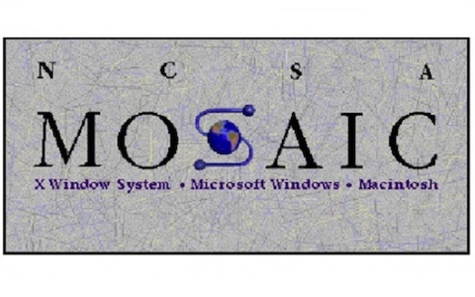

### **_1994_** Mark Andreessen developer of Netscape Navigator which had not yet been released famous post on www-talk thread:

> In fact, it has been a constant source of delight for me
> over the past year to get to continually tell hordes (literally)
> of people who want to -- strap yourselves in, here it comes --
> control what their documents look like in ways that would be
> trivial in TeX, Microsoft Word, and every other common
> text processing environment: "Sorry, you're screwed".

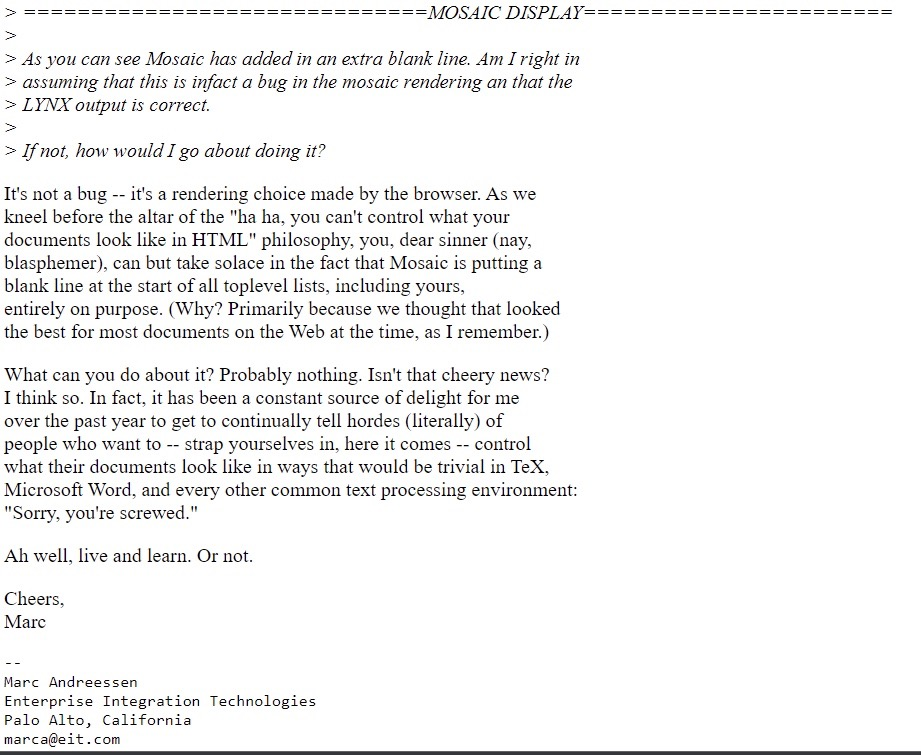

### **_October 13, 1994_** Marc Andreessen announces the 1.0 release of Netscape Navigator

- extended HTML to include presentational elements

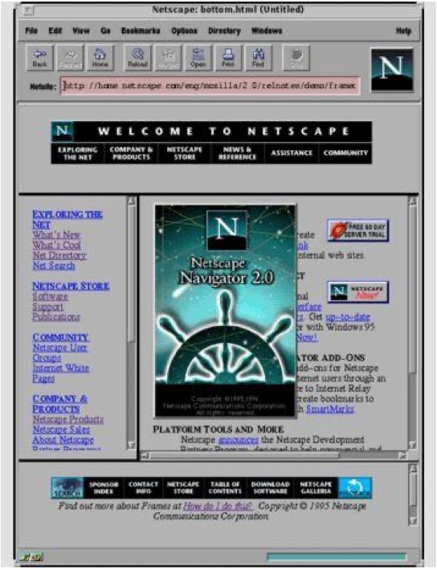

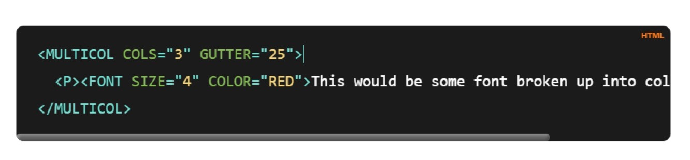

### **_October 10, 1994_ (3 days before)\_**

- Håkon Wium Lie publishes the first draft of… Cascading Style Sheets (CSS)
  - While there were other proposals, CSS was significant in that it provided a way to combine both author and browser (user agent) styles
  - Separating the structure of an HTML page from it's styles was also significant

### **_1995_** World Wide Web Consortium (W3C) began

- at the W3C Conference Hakon meets Thomas Reardon of Microsoft who pledges support of CSS in Internet Explorer

### **_1996_** Internet Explorer 3 first implementation of CSS

### **_1997_** Netscape Navigator implements CSS in reaction to IE's claim to be more standards compliant

- Yes even IE was considered Standard Compliant at one point :)

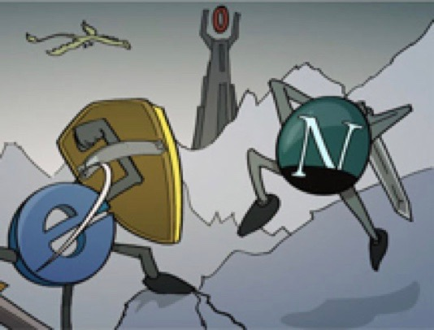

### **_1998_** CSS 2 released

- due to the "Browser Wars" each browser had different implementations of CSS and Eric Meyer (author of several well known CSS books including CSS The Definitive Guide) developed a test suite to compare their browser implementations

### **_1999_** CSS 3 first released

- similar to HTML 5, CSS 3 known simply as "CSS" is in active development and is released in modules so there will never be a CSS 4

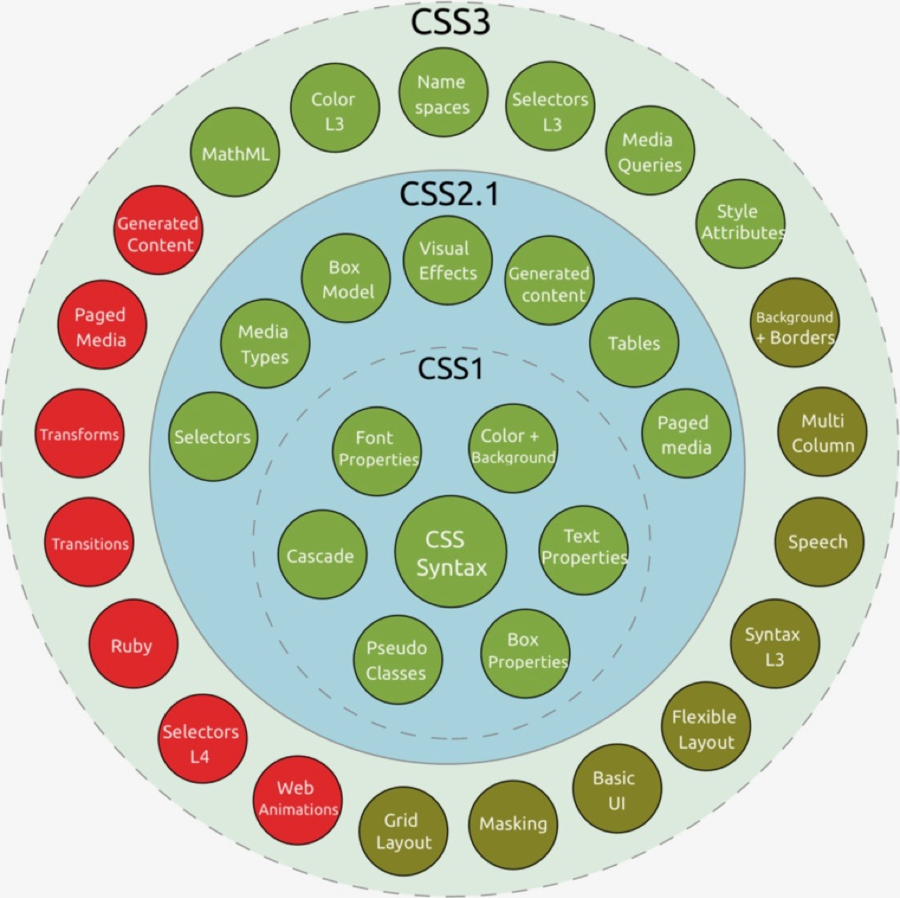

### **_2003_** CSS Zen Garden launches

- CSS Zen Garden illustrating the beauty of CSS designs, CSS developers create different CSS designs for the same HTML page content

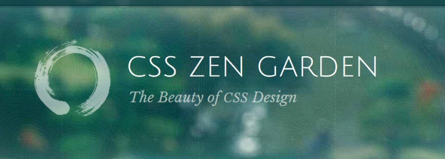

> <http://www.csszengarden.com/>

### **_2004_** WhatWG (Web Hypertext Application Working Group)

- WhatWG (Opera, Mozilla, and Apple) begin to improve HTML in reaction to XHTML which resulted in HTML 5

### **_2006_** Sass Syntactically Awesome Stylesheets

- 1st and most popular CSS extension
- provides productivity for writing and maintaining CSS styles

.sass "indented sass"
: original indented formatting

.scss
: sass of today which looks like css

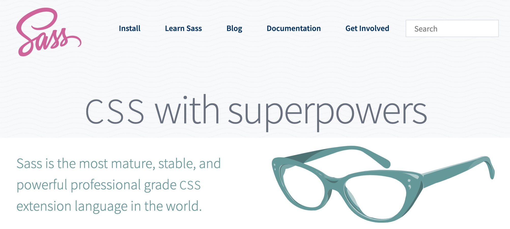

- sass was primarily implemented by Natalie Weizenbaum

## compile sass file

- npx sass --watch input.scss output.css
  - npx sass --watch input.scss:output.css on mac

## compile sass directory

- npx sass --watch ./sass sass-output
  - npx sass --watch ./sass:sass-output on mac

---

## sass color functions

https://tallys.github.io/color-theory/

---

### **_2008_** First Published Version of HTML 5

- WHATWG experts "HTML5 is a continually evolving technology that will never end".

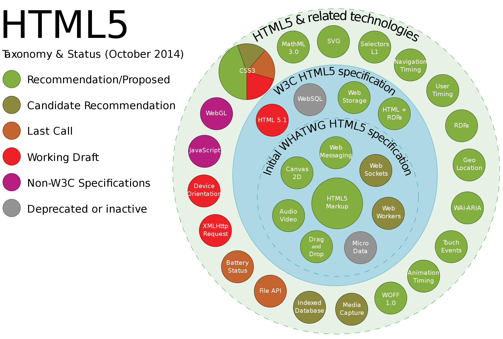

### **_2010_** Steve Jobs declared that flash will never be allowed on Apple's smart devices giving more importance to HTML 5 and CSS

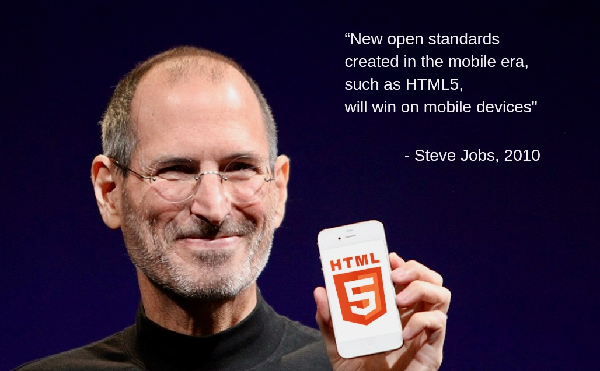

### **_2016_** Flexbox Released

### **_2017_** Grid Layout Released

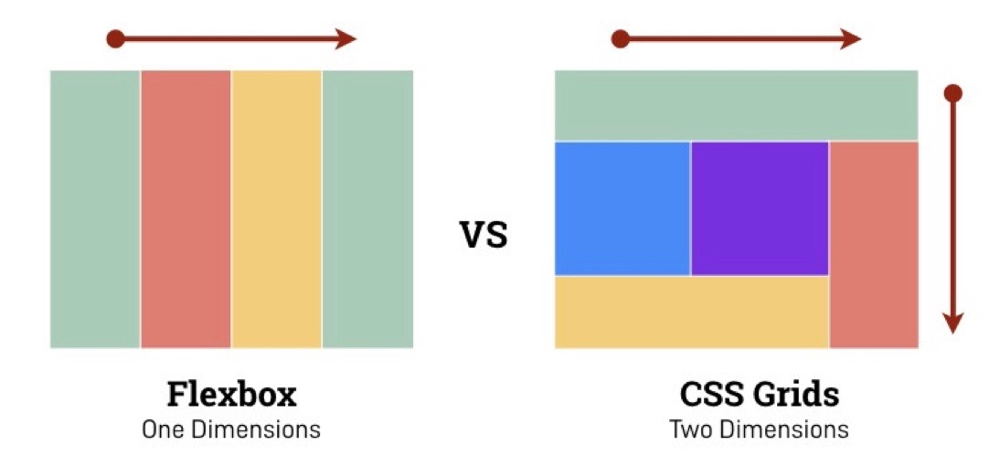

### **2020** State of CSS 2020

- survey conducted in 2020

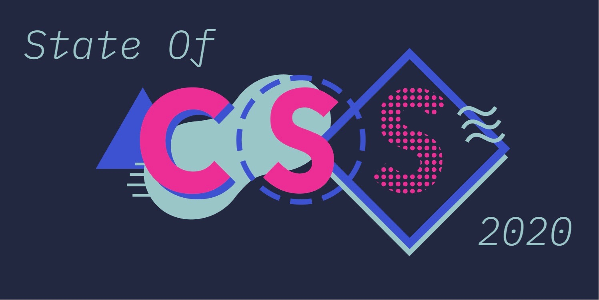

> <https://2020.stateofcss.com/en-US/>

### **September 2021** Chrome Origin Trial of WebGPU

- WebGPU in origin trial in Chrome and experimental in most major browsers is a replacement of WebGL and utilizes web assembly for AR and VR (XR)

---
