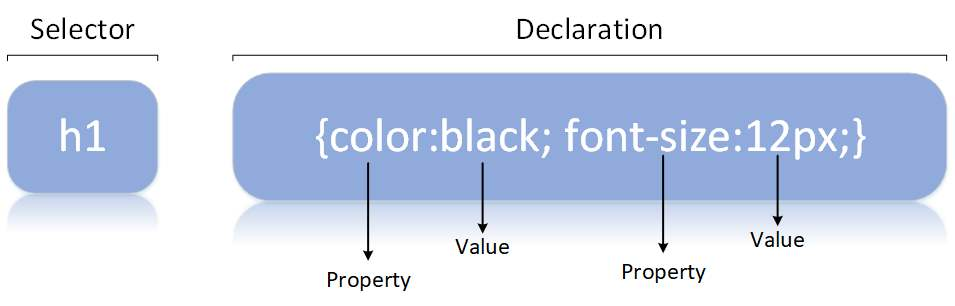
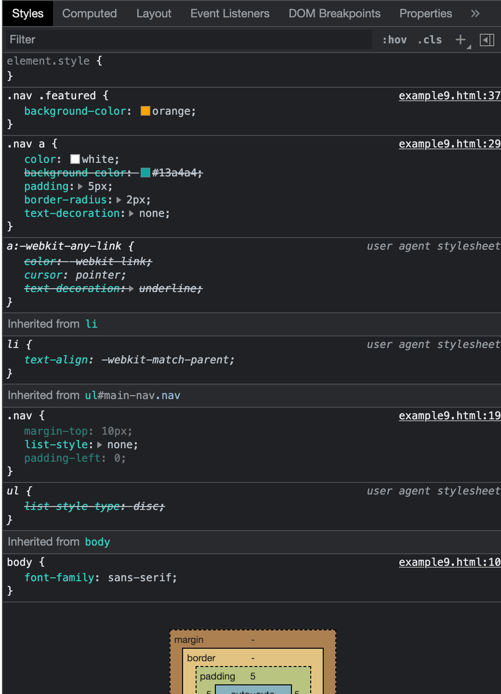

# Chapter 1 The Cascade

## Parts of a css ruleset



Property
: what you want to style

Value
: How you want to style it

```css
h1 {
  color: black;
  font-size: 12px;
}
```

## Cascading Style Sheets

Cascade
: Resolved for every property of every element on the page as multiple values can be applied to a properties conflicts occur

Cascaded Value
: The value that "wins" the cascade having the highest precedence

- at most one cascaded value per property
- may not be a cascaded value if a property is not provided a value in any ruleset

## 3 things used by the cascade to resolve conflicts

### Stylesheet **origin**

1.  Author important **NOT RECOMMENDED**

    ```css
    font-family: serif !important;
    ```

2.  Author
3.  User Agent

    - Example 1
    - Example 2

Author styles
: override user agent styles higher priority

User agent styles
: ex. chrome://settings Appearance

- h1 to h6 and p top and bottom margin
- ol and ul left padding
- link colors
- default fonts and sizes

### **_Specificity_** some styles more specific than others

1. **inline** style attribute

```html
<div style="background-color: blue;"></div>
```

- Selectors appear in all rule sets except inline styles

- If inline style marked important nothing can override them

**NOT RECOMMENDED need to override with Author important !**

- If creating an npm package of components make sure not to have inline styles otherwise whomever uses the component will have to use !important to override styling
- Example 3

2. **Style element**

```html
<head>
  <style>
    .example {
      background-color: blue;
    }
  </style>
</head>

<body>
  <div class="example"></div>
</body>
```

1. **Link element** external .css stylesheet

   - preferred for browser caching as can use across pages

```html
<head>
  <link rel="stylesheet" href="styles.css" />
</head>
```

##### Types of selectors in order of specificity

- a single id has a higher specificity than any number of classes

1. id selectors (#) **NOT RECOMMENDED**

   - when used end up having to copy the selector and add a class to it

2. class selectors (.)

- pseudo-class selectors (:hover)
- attribute selectors (type["input"])

1. tag selectors (div)

universal selector (\*)
: very weak and has no affect on specificity

- also combinators (>, +, - ) have no effect on specificity

```css
html body header h1 {
  color: blue;
}

body header.page-header h1 {
  color: orange;
}

.page-header .title {
  color: green;
}

#page-title {
  color: red;
}
```

| Inline | # ids | . class | tag | notation              |
| ------ | ----- | ------- | --- | --------------------- |
|        |       |         | 4   | 0,0,0,4               |
|        |       | 1       | 3   | 0,0,1,3               |
|        |       | 2       |     | 0,0,2,0               |
|        | 1     |         |     | 0,1,0,0 most specific |

- We can simplify by not using inline styles or #ids

  - then we simply count 2 selectors beat 1 selector

| . classes | tags |
| --------- | ---- |
|           |      |

- Example 4
- Example 5
- Example 6

### **Source Order**

- If comes later takes precedence, considered after origin and specificity

* Example 7

### **LoVe HAte**


- an example where source order matters, as psuedo classes have the same specificity, :link, :visited, :hover, :active, should be in LoVe HAte source order

- user Hovers over a Visited link Hover style takes precedence
- if user Activates the Link while Hovering over it then Active style takes precedence

* Example 8

## Inheritance - last way an element can receive styles


- inheritance values are passed down until overridden by cascaded value

### inherited properties

- text
  - color
  - font
  - font-family
  - font-size
  - font-weight
  - font-variant
  - font-style
  - line-height
  - letter-spacing
  - text-align
  - text-indent
  - text-transform
  - white-space
  - word-spacing
- list
  - list-style
  - list-style-type
  - list-style-position
  - list-style-image
- table borders
  - border-collapse
  - border-spacing

* Example 9

- DevTools display Cascaded Styles at top and inherited values on bottom
  - they are listed in the order of precedence

element.style
: inline styles



---
