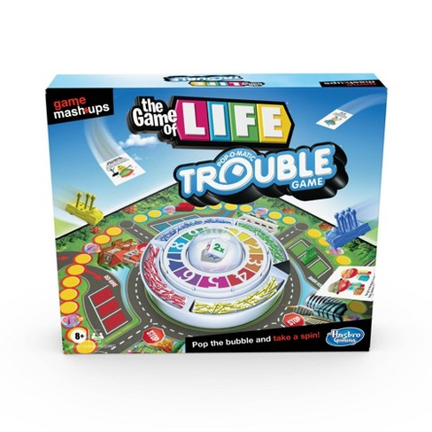

# Chapter 1 Continued The Cascade

## Cascade

1. Origin (Author Important, Author, User Agent)
2. Specificity
3. Inheritance

- Example #9

---

## Selectors

### Basic

**tag selectors** - specificity 0, 0, 1
: body, a

- good for basic styling such as body and anchor tags, otherwise classes preferred

**.class selectors** - specificity 0, 1, 0
: target elements with a particular class name

- always a good idea even when only one element will have class

**#id selectors** - specificity 1, 0, 0
: target element with a particular id

- **NOT RECOMMENDED** - where classes only used for css ids have other purposes
- also increases the complexity of thinking about complexity

```html
<!-- An HTML feature links with # can link to sections of the page -->
<nav>
  <a href="#intro" class="active">Intro</a>
  <a href="#outro">Outro</a>
</nav>
<section id="intro" class="main-section highlighted">
  <p>This is the intro section.</p>
</section>
<section id="outro" class="main-section">
  <p>This is the outro section.</p>
</section>
```

**_"\*"_** universal selector\*\* - specificity 0, 0, 0
: targets all elements but very low specificity

---

## Compound Selectors (vs. Simple Selectors)

**compound selector** .dropdown.is-active
: targets elements that match all its simple selectors

```html
<style>
  /* compound selector */
  /* if a space between .dropdown .is-active 
    would be a descendant selector and
    target any element under .dropdown 
    with class is-active */
  .dropdown.is-active {
    color: green;
  }
</style>
<!-- compound selector -->
<!-- targets this -->
<div class="dropdown is-active">Styled</div>
<!-- but not this -->
<div class="dropdown">
  <span class="is-active">Not Styled</span>
</div>
```

**_NOTE_** compound selectors like descendant combinators provide the another way to add more info so create more precedence

---

## Combinators

- combine multiple selectors

#### descendant vs direct descendant combinators

**descendant combinator**
: div p

- has a space
- p can be nested at any depth under div
- the most commonly used combinator
- can have multiple div p span

```html
<style>
  div p {
    color: lightslategray;
  }
</style>
<div>
  <p>styled</p>
  <!-- style applied here -->
  <article>
    <p>styled</p>
    <!-- style applied here -->
  </article>
</div>
```

**direct descendant combinator**
: div > p

- p **must be nested \***directly\*\*\* under the div
- child parent relationship
- can have multiple div > p > span

```html
<style>
  div > p {
    color: lightsalmon;
  }
</style>
<div>
  <p>styled</p>
  <!-- style applied here -->
  <article>
    <p>not styled</p>
  </article>
</div>
```

#### general sibling vs adjacent sibling combinators

**general sibling combinator**
: h2 ~ p

- targets sibling elements following a specified element

```html
<style>
  /* general sibling combinator */
  h2 ~ p {
    color: lightseagreen;
  }
</style>
<div> <!-- have to have the same parent -->
  <h2>not targeted</h2>
  <p>styled</p> <!-- style applied here -->
  <h2>not targeted<h2>
  <h3>not targeted</h3>
  <p>styled</p>  <!-- style applied here -->
</div>
```

**adjacent sibling combinator**
: p + h2

- targets sibling elements directly following (adjacent) a specified element
- can have multiple p + h2 + a

```html
<style>
  /* adjacent sibling combinator */
  p + h2 {
    color: lightcoral;
  }
</style>
<div> <!-- have to have the same parent -->
  <p>A paragraph</p>
  <h2>styled heading<h2> <!-- style applied here -->
</div>
```

- Example #10

---

## Manipulating the Cascade with Inherit and Initial

inherit
: for inheritance to take precedence over a cascaded value

- can also force inheritance for properties not normally inherited such as padding or margins
- Example 11

initial
: to undo an cascaded value

```css
/* remove a border from an element */
div {
  border: initial;
}
```

**NOTE** **auto** is not the default for all properties or many properties

```css
div {
  margin: auto; /* only valid because the initial value for margin is auto */
  border-width: auto; /* invalid */
  padding: auto; /* invalid */
}
```

```css
/* instead do this */
div {
  margin: initial;
  border-width: initial;
  padding: initial;
}
```

**NOTE** **initial** does not work in IE11 or Opera mini but all other major browsers

### [caniuse](https://caniuse.com/)

- as with JavaScript can use https://caniuse.com/ to determine if a feature is supported
- this is recommended in checking css features, properties and styles to check the browsers need to support
- look at the market share feature to see if generally safe

- Example 12

## Shorthand Properties

shorthand properties
: allow you to set values for several other properties at the same time

- Shorthand properties include font, background, border

**NOTE** as font shorthand property sets so many values best to just use it to set body font

```css
div {
  font: italic bold 18px/1.2 'Helvetica', 'Arial', sans-serif;
}

/* equivalent to */

div {
  font-style: italic;
  font-variant: normal;
  font-weight: bold;
  font-stretch: normal;
  font-size: 18px;
  line-height: 1.2;
  font-family: 'Helvetica', 'Arial', sans-serif;
}
```

```css
div {
  border: 4px dotted #32a1ce;
}

/* shorthand border property equivalent to the following */
/* each of these also a shorthand property */
div {
  border-width: 4px;
  border-style: dotted;
  border-color: #32a1ce;
}
```

```css
div {
  border-width: 0px 10px 20px 30px;
}
/* shorthand border-width property equivalent to */
div {
  border-top-width: 0px;
  border-right-width: 10px;
  border-bottom-width: 20px;
  border-left-width: 30px;
}
```

- Example 13

## Shorthand Properties Quirks

1. If you omit values and only specify the values concerned with the others will get their initial values (NOT their cascaded values)

```css
div {
  font: italic 18px/1.2 'Helvetica', 'Arial', sans-serif;
}

/* leaving out font weight will set font weight to initial value of normal */

div {
  font-style: italic;
  font-weight: initial; /* initial which would be normal */
  font-size: 18px;
  line-height: 1.2;
  font-family: 'Helvetica', 'Arial', sans-serif;
}
```

Example #14

2. Understanding shorthand properties order

```css
/* shorthand properties try to be lenient */

div {
  border: 1px solid black;
}

/* same as */

div {
  border: black 1px solid;
}
```

### 4 value properties (clock) **TRouBLe** Top Right Bottom Left

- sometimes order matters, it's clockwise Top Right Bottom Left



Example #15

#### TRBL Truncated Notations

```css
div {
  /* the following are equivalent */
  padding: 1em 2em; /* TB 1em RL 2em */
  /*        T   R  B  (since no L value given its taken from the opposite side) */
  padding: 1em 2em 1em; /* T 1em RL 2em 1 1em */
  padding: 1em 2em 1em 2em; /* T 1em R 1em B 1em L 1em */
}

div {
  /* the following are equivalent */
  padding: 1em; /*TRBL 1em*/
  padding: 1em 1em; /* TB 1em RL 1em */
  padding: 1em 1em 1em; /* T 1em RL 1em B 1em */
  padding: 1em 1em 1em 1em; /* T 1em R 1em B 1em L 1em */
}
```

Example #16

#### 2 value properties (Cartesian grid)

- with 4 value properties TRBL vertical top/bottom then horizontal left/right
- with 2 value properties the order is reversed horizontal then vertical
- why? because of the Cartesian grid x (across) then y (down)

```css
background-position: 25% 75% /* 25% horizontal 75% vertical */
box-shadow: 10px 2px #6F9090; /* 10 pixels right x then 2 down y */
text-shadow: 1px 2px #FF0000; /* 1 pixel right x then 2 down y */
```

Example #17
