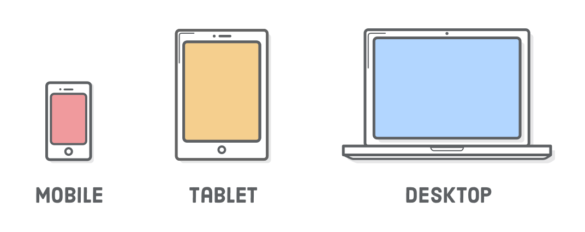
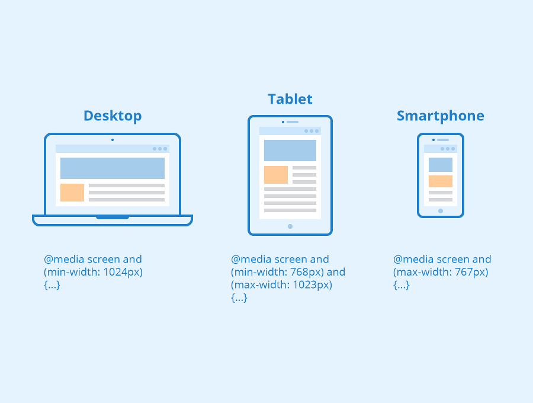
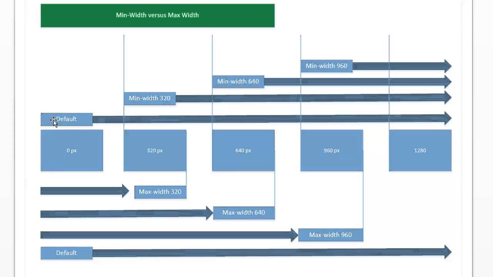

# Chapter 8 Responsive Design



## 2 approaches for developing for multiple sized devices

- how to design a site so that its usable and appealing on any device

### 1. "m dot"

m dot
: initially 2 websites desktop and mobile, streamlined experience for smaller screens, server redirected from http://www.mysite.com to http://m.mystie.com

- with more and more sized devices this approach broke down

### 2. Responsive Design

Responsive Design
: don't need 2 different websites instead same stylesheet that behaves differently for desktop and mobile

## 3 key principles to Responsive Design:

1. Mobile 1st approach to design
   - design mobile site first also helpful to have other device designs when layout the HTML
2. media queries
   - conditions in stylesheet for viewports and screen resolutions
3. Use of fluid layouts
   - containers scale to different sizes based on width of viewport

## 1. why mobile 1st? (it's about constraints)

Progressive Design
: progressively expose functionality based on the capabilities of the device

- focus on content as mobile users more task oriented than on desktop
- easier to add in functionality rather than remove it
- screen space and network limited
- different interactive controls, ex. **_no hover_**

### mobile 1st design often coincides with a11y

- with mobile 1st design and a11y focusing on the important stuff

ex. have an article and sidebar

- for both mobile 1st and a11y want the focus to be on the article then sidebar, with a screen reader reading links in the article before those in sidebar

## 2. media queries

- recommend looking at media queries as a range between min and max and then work from there



media queries
: allow you to write a set of styles that only apply to the page under certain conditions such as screen size

### media queries follow normal rules of cascade

- can override or be overridden by rules outside the media query (based on selector specificity or source order)
- the media query itself does not affect specificity

### @media at-rule

@media at-rule
: target devices that match a specified feature

```css
.title > h1 {
  color: #333;
  text-transform: uppercase;
  font-size: 1.5rem;
  margin: 0.2em 0;
}

/* when viewport >= 35rem overrides the mobile font-size (1.5rem) with a larger one .25rem */
/* point at which window 35em (560px / 16px) is know as the breakpoint */
@media (min-width: 35em) {
  .title > h1 {
    font-size: 2.25rem;
  }
}
```

breakpoint
: point at which the page styles change to provide the best possible layout for the screen size

ems
: the only media query breakpoint unit that performs consistently in all major browsers

- should the user zoom or change default font size
- benefit scale up or down with the user's default font size

@media at-rule and
: media query that targets devices that meet both criteria

```css
/* devices that are between 20 and 35 em */
@media (min-width: 20em) and (max-width: 35em) {
}
```

@media at-rule comma
: media query that target devices that meet one of a multiple

```css
/* devices that are either less than 20em <= 20em or >= 35em */
@media (max-width: 20em), (min-width: 35em) {
}
```

### media feature



| media feature          |                                                                                       |
| ---------------------- | ------------------------------------------------------------------------------------- |
| min-width: 20em        | targets viewports 20em and wider                                                      |
| max-width: 20em        | targets viewports 20em and skinnier                                                   |
| min-height: 20em       | targets viewports above 20em height                                                   |
| max-height: 20em       | targets viewports below 20em height                                                   |
| orientation: landscape | targets viewports wider than tall                                                     |
| orientation: portrait  | targets viewports taller than wide                                                    |
| min-resolution: 192dpi | targets viewports with more than 2 dots per pixel screen resolution (retina displays) |
| max-resolution: 192dpi | targets viewports with less than 2 dots per pixel                                     |

#### min-resolution and max-resolution

- use it when you want to serve higher-resolution imagery or icons to screens that can benefit from them

```css
@media (-webkit-min-device-pixel-ratio: 2), (min-resolution: 192dpi) {
}
```

### media types

| media type |                               |
| ---------- | ----------------------------- |
| screen     | how the screen looks          |
| print      | how the page looks if printed |

```css
@media screen {
}

@media print {
  /* use display:none to hide parts of the page wouldn't want to print */
  * {
    /* !important so don't need to be concerned by cascade */
    color: black !important;
    background: none !important;
  }
}
```

### viewport meta tag

- documents how content should be rendered on devices

```html
<meta name="viewport" content="width=device-width, initial-scale=1.0" />
```

#### content attribute

width
: the width that the browser should render on the device

- with a value, such as 320, would mean to make browser to be a width of 320px

initial-scale:
: the zoom level when the page loads (1 means set the zoom level to 100%)

user-scalable:
: generally not used as used to prohibit the user from using 2 finger zoom (user-scalable=no)

### Mobile 1st Approach with Media Queries

1. Write mobile styles 1st outside of media queries
2. Work way up to larger breakpoints with min-width
3. use max-width sparingly with too many not following mobile first approach

```css
/* mobile */
.title {
}

/* medium breakpoint */
@media (min-width: 35em) {
  .title {
  }
}

/* large breakpoint overrides medium breakpoint */
@media (min-width: 50em) {
  .title {
  }
}
```

---

## Implementing Responsive Design

### Responsive Font Sizes

```css
/* one approach for fonts to be responsive with viewport sizes */
:root {
  box-sizing: border-box;
  /* 1/100 of the viewport width + .6 * 16px = 9.6px */
  /* base font-size scales slightly with the viewport */
  font-size: calc(1vw + 0.6em);
}
```

- Example #1

- In section 5 semantic html css and scss will see another example of responsive font sizes

### Implement Mobile 1st version with consideration of the larger viewports

<!-- putting nav outside header allows the nav to naturally follow the
        header in desktop -->
<header id="header" class="page-header">
  <div class="title">
    <h1>Wombat Coffee Roasters</h1>
    <div class="slogan">We love coffee</div>
  </div>
</header>
<!-- screen readers find nav as a landmark and then the button to toggle the menu on mobile -->
<nav class="menu" id="main-menu">
  <button class="menu-toggle" id="toggle-menu">toggle menu</button>
  <div class="menu-dropdown">
    <!-- at first hidden -->
    <ul class="nav-menu">
      <li><a href="/about.html">About</a></li>
      <li><a href="/shop.html">Shop</a></li>
      <li><a href="/menu.html">Menu</a></li>
      <li><a href="/brew.html">Brew</a></li>
    </ul>
  </div>
</nav>
```

#### creating a hamburger menu

```css
.menu {
  /* establishes containing block for both absolutely positioned children */
  /* the toggle button and dropdown */
  position: relative;
}

/* 1st absolutely positioned child */
.menu-toggle {
  position: absolute;
  top: -1.2em; /* pulls the button up outside its containing block */
  right: 0.1em; /* along the right side of the screen */
  border: 0; /* removes the border normally on buttons */
  background-color: transparent;
  font-size: 3em;
  width: 1em; /* fix width at 1em */
  height: 1em;
  line-height: 0.4;
  text-indent: 5em; /* hides the text content of the button */
  white-space: nowrap;
  overflow: hidden;
}

/* 2nd absolutely positioned child */
.menu-toggle::after {
  position: absolute;
  top: 0.2em;
  left: 0.5em;
  display: block;
  content "\2261"; /* unicode symbol, hamburger icon */
  text-indent: 0;
}

.menu-dropdown {
    display: none;
    position: absolute;
    right: 0;
    left: 0;
    margin: 0;
}

 /* when menu gets is-open class added display dropdown */
.menu:is-open .menu-dropdown {
    display: block;
}
```

- Example #2

### Add Media Queries for larger viewports

Landmark
: Screen readers use HTML elements form, main, nav, aside as landmarks to quickly navigate the page

```html

```

## Container Queries

https://developer.mozilla.org/en-US/docs/Web/CSS/CSS_Container_Queries
