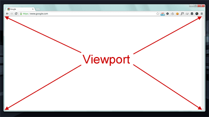
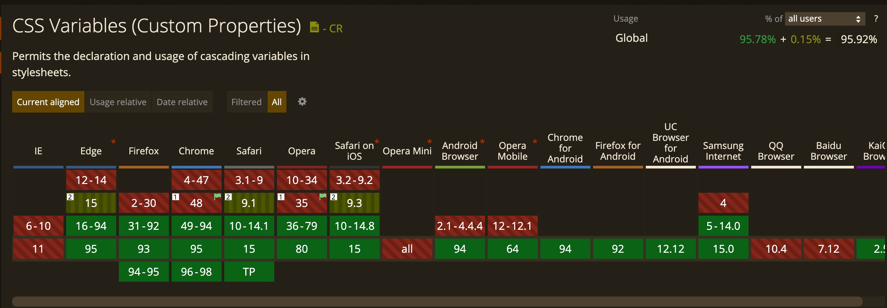
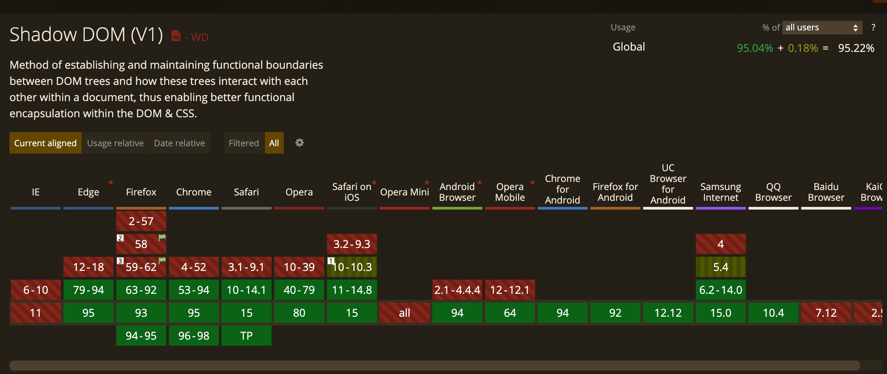

# Chapter 2 Continued Working with Relative Units

## em

- defined by the current element's font-size
- with font-size it is based on the inherited font-size

### shrinking font problem

```css
body {
  font-size: 16px;
}

ul {
  font-size: 0.8em; /* Each font-size is based on the previous font-size */
  /*16px * .8 = 12.8 * .8 = 10.24 * .8 = 8.192 .... */
}
```

- inherited font sizes nested elements such as lists results in shrinking fonts

- Example #7

#### solutions to the shrinking font problem

1. set the child elements to 1em

```css
body {
  font-size: 16px;
}

ul {
  font-size: 0.8em;
}

/* descendant combinator:  a ul at any depth under an ul */
ul ul {
  font-size: 1em; /* first font-size will start with .8em and then 1 * .8em = .8em*/
}
```

- not ideal as setting a size then immediately overriding this size
- Example #8

| em useful for: |
| -------------- |
| padding        |
| width          |
| height         |
| border-radius  |

- BUT: tricky for font-size

2. rem root em, a better alternative

## rem

em
: relative to the current element

rem
: relative to the root element

- no matter where it's placed in the css stylesheet 1.2 rem is 1.2 \* the root element's font-size

### What is the root element?

- when browser parses HTML elements it creates a tree structure in memory called the Document Object Model (DOM) where each element is a node

```html
<html>
  <!-- the top level or root node, ancestor of all other nodes -->
  <head>
    <!-- next level tree node -->
  </head>
  <body></body>
</html>
```

```css
/* the root node has a special pseudo-class selector */
/* equivalent to html tag selector but with the specificity of a class */
/* html tag is (0,0,1) whereas root pseudo-class (0,1,0) */
:root {
}
```

```css
:root {
  font-size: 1em; /* uses browser's 16px (origin user agent style) */
}

ul {
  /* rem relative to the root element not the current element */
  font-size: 0.8rem; /* root element 1em = 16px * .8 = 12.8px */
}
```

- Example #9

## when to use px, em, rem? It depends but...

| units | when to use ?                                               |
| ----- | ----------------------------------------------------------- |
| px    | borders (can keep borders thin)                             |
| rem   | font-size                                                   |
| em    | most other measures (padding, width, height, border-radius) |
| %     | container widths                                            |

## Ally - use relative units

- default size is vital for some users but only changes the size of relative units

| Ctrl (Command) + / Ctrl (Command) | chrome://settings/appearance default font size |
| --------------------------------- | ---------------------------------------------- |
| temporary                         | changes font size of relative sizes            |
|                                   | https://www.cnn.com/ vs https://www.freep.com  |

## Anti Pattern simplifying to 10px

```css
html {
  font-size: 0.625em; /* .625 * 16px = 10px; */
  /* allows scaling by 10, so as the root is set to 10px then 1.4rem is 14px */
}
```

### Why not simplify to 10px?

- while absolute sizes are easier to talk about as concrete

  - 10px is too small for most text so have to override it with 1.4rem and other sizes throughout the stylesheet

  - should think of 1.4rem as bigger than 1.2 rem instead of 1.4rem as 14px
  - Responsive design involves thinking fuzzy

> 

## Best Practice set a root font size

```css
:root {
  font-size: 0.875em; /* .875em * 16px = 14px */
}
```

- Example #10

## Media queries

@media
: media rules specify styles to apply at certain screen sizes

- or media types (print or screen)

```css
/* as long as use relative units allows the entire site to scale */
/* smaller screens */
:root {
  font-size: 0.75em; /* .75 * 16px = 12px */
}

@media (min-width: 800px) {
  /* screens 800px or wider 14px */
  :root {
    font-size: 0.875em; /* .875em * 16px = 14px */
  }
}

@media (min-width: 1200px) {
  /* screens 1200px or wider 16px */
  :root {
    font-size: 1em;
  }
}
```

- Example #11 (show in DevTools mobile iPhone / IPad also)
- Example #12

## Viewport-relative units

- whereas em and rem are defined relative to font-size
- viewport-relative units are defined relative to the browser's viewport

> 

| units | definition                                        |
| ----- | ------------------------------------------------- |
| vw    | 1/100th of the viewport width                     |
|       | 50vw 50% or 1/2 the width of the viewport         |
| vh    | 1/100th of the viewport height                    |
|       | 25vh 25% of the height of the viewport            |
| vmin  | 1/100th of the smaller dimension, width or height |
| vmax  | 1/100th of the larger dimension, width or height  |

```css
/* vmin size, if 90vmin so 90% of either the width (if portrait) or height (if landscape) */
.square {
  width: 90vmin;
  height: 90vmin;
  background-color: #369;
}

/* can use on font-size for smooth scaling */
.square-text {
  /* on a monitor 1,200 pixels 2% of 1,200 = .02 * 1200 = 24px */
  /* on a tablet 768 pixels 2% of 768 = .02 * 768 = 15.36px */
  font-size: 2vw;
}
```

- Example #13

## calc

- calc() function basic arithmetic with 2 values which can have different units (+,-,\*,/)

```css
/* must have a space on either side of the operator */
/* .5em the base a minimum font size and 1vw a responsive scalar */
/* scales from 11.75px on an iPhone6 to 20px for 1,2000 px browser window */
:root {
  font-size: calc(0.5em + 1vw);
}
```

- Example #14

## unitless numbers

unitless number
: number with no specified unit

| properties with unitless values | notes                                  |
| ------------------------------- | -------------------------------------- |
| line-height                     | accepts both units and unitless values |
| z-index                         |                                        |
| font-weight                     | 700 for bold, 400 normal               |

### unitless value 0

- can use for lengths (px, em, or rem) or %
- can't be used for angular values such as degrees or time-based values for seconds

### Best Practice use unitless values for line-height

```css
body {
  /* unitless line height is recalculated for each descendant element */
  line-height: 1.2;
}

.about-us {
  font-size: 2em; /* 2 * 16px = 32px * 1.2 = 38.4px line height */
}
```

- Example #15

```css
body {
  /* line height with units is inherited */
  line-height: 1.2em; /* 1.2 * 16px = 19.2px */
}

.about-us {
  font-size: 2em; /* 2 * 16px = 32px but 19.2px line height */
}
```

- Example #16

### When an element has a value defined using a length (px, em, rem, ...) it's computed value is inherited by child elements

length
: formal name for a CSS value that denotes a distance measurement, a number followed by a unit

## CSS Variables (Custom Properties)

- must be defined inside of a declaration block
- if evaluates to an invalid value then property set to initial value

```css
:root {
  /* root so can be used on the whole page */
  /* Custom Property or CSS variable --main-font */
  /* starts with -- to distinguish from CSS properties */
  --main-font: Helvetica, Arial, sans-serif;
  --brand-color: #369;
}

p {
  /* function var() to use variables */
  /* 2nd parameter is a default value */
  font-family: var(--main-font, sans-serif);
  color: var(--secondary-color, blue);
  /* uses blue as --secondary-color not defined */
}
```



- CSS variables cascade and inherit
- Example #17

## 4 Pillars of Web Components


### Pilar 1: Custom Elements (always have a dash in their name)

> customElements.define('my-component', MyComponent);

### Pilar 2: Shadow DOM (Show in Chrome)

```css
/* Use CSS Variables for styling */
:root {
  --info-color-background: lightblue;
}
```

- Example popup-info.js line 53 and popup-info.html

### Pilar 3: HTML Templates and Slots

```html
<template></template>
<!-- an HTML 5 element that doesn't render unless you let it -->
```

### Pilar 4: JS Imports (ES Modules)

- Example template-example.html


