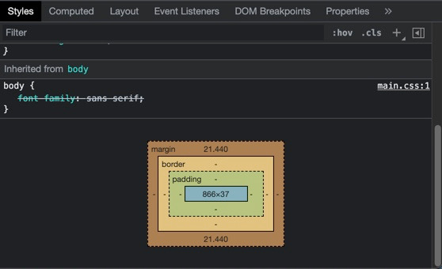

# Chapter 3 Mastering the Box Model

- Example #1

## Box Model

- every element is represented by a box in css


- NOTE: Can see the box model in ChromeDevTools
  - selecting an element



- default behavior (box-sizing: content-box) when set width or height of element
  - setting the width and height of the content
  - any padding, border, or margins are added to that

padding
: space between content and border

border
: outline around an element

margin
: not part of the element its the spacing between the element and it's next sibling

```css
body {
  margin: 0; /* the body of an html page has a margin */
}
```

```css
div {
  width: 300px; /* (width 300 px) */
  padding: 10px; /* (padding-left 10px) (width 300px) (padding-right 10px) = 320px */
  border: 1px solid blue; /* a shorthand */
  /* (border-left 1px) (padding-left 10px) (width 300px) (padding-right 10px) (border-right 1px) = 322px */
}
```

### Floats

- even though setting width to be 70% and 30% they take more than 100% space so wrap

```css
.main {
  /* float left with a width of 70% */
  float: left;
  width: 70%;
  background-color: #fff;
  border-radius: 0.5em;
}

.sidebar {
  /* float left with a width of 30% */
  float: left;
  width: 30%;
  padding: 1.5em; /* 1.5em + width 30% + 1.5 em, so 3em bigger than 100% */
  background-color: #fff;
  border-radius: 0.5em;
}
```

- Example #2

#### Options

- use a magic number, an Anti Pattern

  - a width of 26% would work on some displays

- use calc() function

```css
.sidebar {
  /* float left with a width of 30% */
  float: left;
  width: calc(30% - 3em); /* remove the padding from the width */
  padding: 1.5em;
  background-color: #fff;
  border-radius: 0.5em;
}
```

- Example #3
- **_Best Practice_** change box-sizing value

  - box-sizing: content-box (default)
  - box-sizing: **_border-box_**
    - combined size of the content, padding, and border

```css
/* now add up to 100% as inclusive of padding */
.main {
  /* box-sizing border-box */
  box-sizing: border-box;
  float: left;
  width: 70%;
  background-color: #fff;
  border-radius: 0.5em;
}

.sidebar {
  /* box-sizing border-box */
  box-sizing: border-box;
  float: left;
  width: 30%;
  /* instead of padding making the element wider makes the inner content narrower */
  padding: 1.5em;
  background-color: #fff;
  border-radius: 0.5em;
}
```

- Example #4

### Universal Border Box Sizing

- applies border box sizing to all elements and pseudo-elements on the page
- recommend for all new sites

```css
/* universal border-box sizing */
/* NOTE: best practice to style document top to bottom */
:root {
  box-sizing: border-box;
}

*,
::before,
::after {
  box-sizing: inherit; /* by default box-sizing is not inherited */
}
```

#### If 3rd Party component needs content-box

```css
.third-party-component {
  box-sizing: content-box;
}
```

- Example #5

## Adding a gutter between columns

- visually appealing to have a gap (or gutter) between columns

### Approach: subtract a percentage

```css
/* of course assumes universal border-box fix */
.main {
  float: left;
  width: 70%;
  background-color: #fff;
  border-radius: 0.5em;
}

.sidebar {
  float: left;
  width: 29%;
  margin-left: 1%; /* subtract 1% from the width for gutter */
  padding: 1.5em;
  background-color: #fff;
  border-radius: 0.5em;
}
```

- Example #6

### **_Recommended_** Approach: use calc subtracting em's from width and adding to margin

- more clear what the change is, apparent that changing the 30%

```css
/* of course assumes universal border-box fix */
.main {
  float: left;
  width: 70%;
  background-color: #fff;
  border-radius: 0.5em;
}

.sidebar {
  float: left;
  width: calc(30% - 1.5em); /* subtract from width */
  margin-left: 1.5em; /* add space as a margin */
  padding: 1.5em;
  background-color: #fff;
  border-radius: 0.5em;
}
```

- Example #7
