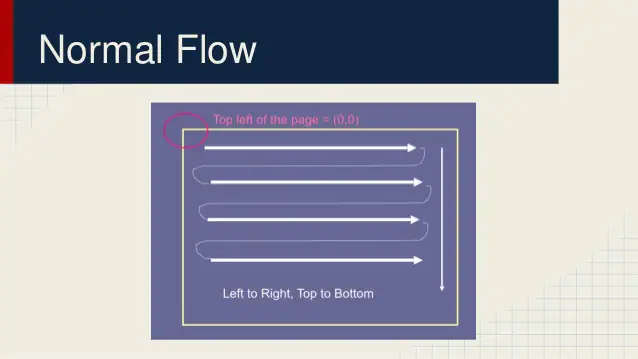
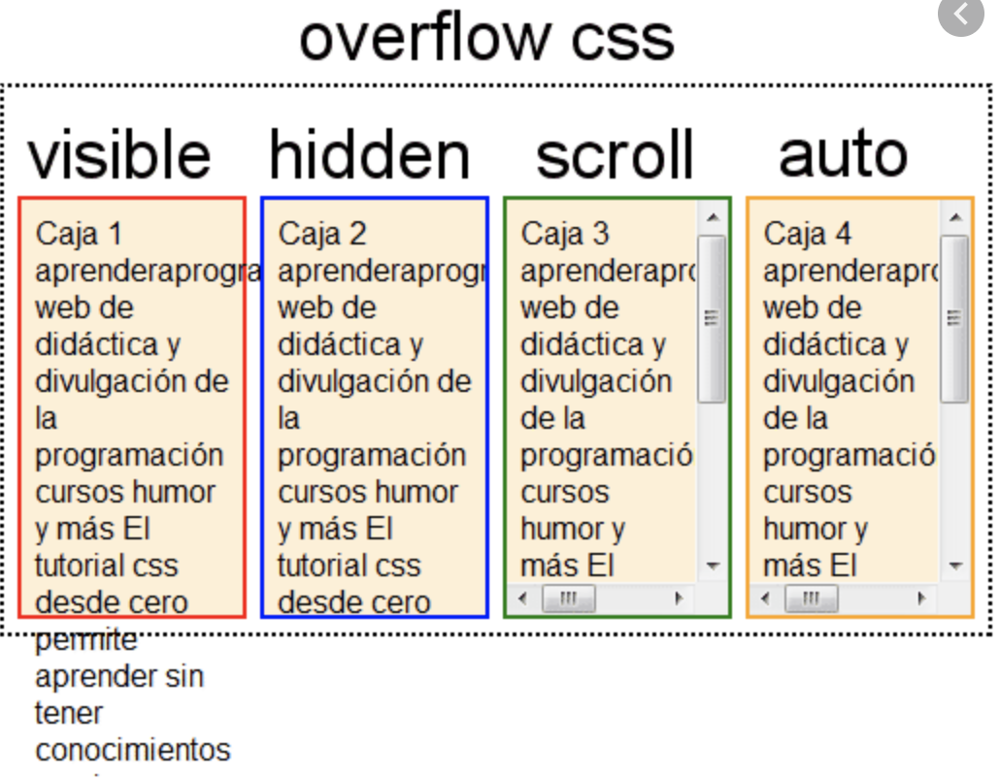
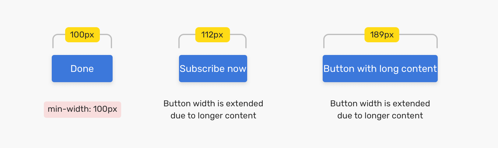
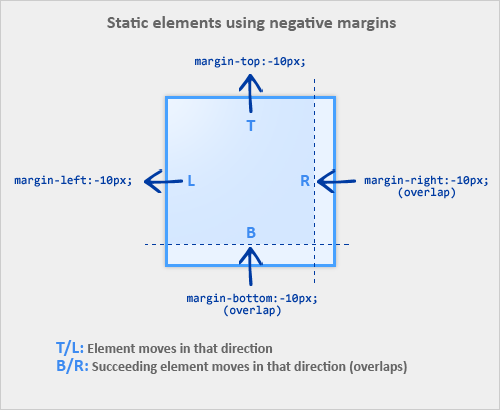

# Chapter 3 Continued Mastering the Box Model

## Document Flow

**_normal document flow_**
: default behavior of elements on the page, constrains width and unlimited height

- height of container: organically determined by contents not container itself



**_inline elements_**: flow with text of the page from left to right, line wrapping when reach the edge of container

**_block-level elements_**: fall on individual lines, with a line break before and after

---

### Overflow

- content overflows the container when content doesn't fit the specified container
- document flow doesn't account for overflow and content below the container will render over the top of the overflowing content



```css
div {
  overflow: visible; /* default, all content visible */
  overflow: hidden; /* hidden, content clipped */
  overflow: scroll; /* scrollbars visible even if all content visible */
  overflow: auto; /* scrollbars visible when content overflows (generally preferred over scroll) */
}
```

- NOTE: scrollbars should be used with care, browsers add scrollbars for scrolling the page, and nested scrollbars can be frustrating as inner scrollbars grab focus when scrolling the page

#### Horizontal Overflow

- content can overflow horizontally if content bigger than element horizontally

overflow-x
: controls overflow horizontally

overflow-y
: controls overflow vertically

- setting different values for each overflow-x and overflow-y can be unpredictable

```css
div {
  overflow-x: visible; /* all horizontal content visible */
  overflow-x: hidden; /* horizontal content clipped */
  overflow-x: scroll; /* horizontal scrollbar visible even if all horizontal content visible */
  overflow-x: auto; /* horizontal scrollbars visible when content overflows (generally preferred over scroll) */
  overflow-y: visible; /* all vertical content visible */
  overflow-y: hidden; /* vertical content clipped */
  overflow-y: scroll; /* vertical scrollbar visible even if all vertical content visible */
  overflow-y: auto; /* vertical scrollbars visible when content overflows (generally preferred over scroll) */
}
```

---

### %s for Heights can be problematic

- ignored as percentage height of the container determined by the height of the container's children providing a circular definition that is ignored

  - **_unless_** parent of the container has an explicitly defined height

- **_instead_** use viewport relative heights 100vh for exactly the height of the viewport

### Set columns of equal heights

#### Anti Pattern: setting arbitrary heights for each column, **_never_** do this!

- as what size should they be?

#### Best Practice to set columns of equal heights use CSS tables

##### 2 types of CSS tables display: table for IE8+ or flexbox IE10+

- CSS tables provide a way to replace the non semantic HTML table elements without using hacks or floats (the only other option at that time)
- Use flexbox unless needs to support IE9+

#### display:table to set columns of equal heights

```css
/* NOTE table-row not required */
.container {
  display: table; /* container resembles a table */
  width: 100%; /* as display:table won't expand to 100% like block element */
}

.main {
  display: table-cell; /* resembles a table cell */
  width: 70%;
  background-color: #fff;
  border-radius: 0.5em;
}

.sidebar {
  display: table-cell; /* resembles a table cell */
  width: 30%;
  /* doesn't work to create gutter as margin's don't work with table cells */
  margin-left: 1.5em;
  padding: 1.5em;
  background-color: #fff;
  border-radius: 0.5em;
}
```

##### Fixing the problem of margin's not working with table cells

- need to use border-spacing for horizontal and vertical spacing

```css
/* also adds padding the left of the right of the columns */
/* border spacing is 2 value so think x and y coordinates this is not the 4 value TRBL */
div {
  border-spacing: 1.5em 0;
}
```

```css
/* to remove the left and right padding that was added by the border-spacing */
.wrapper {
  margin-left: -1.5em; /*instead of pushing in moves the left edge out */
  margin-right: -1.5em; /*instead of pushing in pulls the edge to right */
}

/* border spacing is 2 value so think x and y coordinates this is not the 4 value TRBL */
.container {
  display: table;
  width: 100%;
  border-spacing: 1.5em 0; /* for horizontal spacing but also adds spacing on the left and right */
}

.main {
  display: table-cell;
  width: 70%;
  background-color: #fff;
  border-radius: 0.5em;
}

.sidebar {
  display: table-cell;
  width: 30%;
  padding: 1.5em;
  background-color: #fff;
  border-radius: 0.5em;
}
```

#### flexbox to set columns of equal heights

- notably don't need the extra wrapper div or negative margins
- child elements the same height by default
- even when widths and margins add up to more than 100% flexbox sorts it out

```css
.container {
  display: flex; /* applies flex display to the container */
}

.main {
  width: 70%;
  background-color: #fff;
  border-radius: 0.5em;
}

.sidebar {
  width: 30%;
  padding: 1.5em;
  margin-left: 1.5em; /* margins do work with flexbox */
  background-color: #fff;
  border-radius: 0.5em;
}
```

- Example #8

### min-height and max-height, min-width and max-width,

- container will grow
  - min-width and min-height
- or stop growing
  - max-width and max-height



- if content is bigger than the max then it will overflow

---

### Vertically centering content

#### vertical-align: middle

- only works to align elements on the same line for inline, inline-block, and table-cell (NOT block) elements
  - can use to align image with neighboring text

#### Best Practice, use a natural height container, allow browser determine heights naturally

- works with any display type block, inline, table-cell
- does require a padding above and below the element

```css
header {
  /* equal top and bottom padding vertically centers an element's content */
  padding-top: 4em;
  padding-bottom: 4em;
  color: #fff;
  background-color: #0072b0;
  border-radius: 0.5em;
}
```

- Example #9

#### Best Best Practice, use flexbox

#### Other options

- If just one line of text can set line-height of the container height, will only work for inline / inline-block
- All other options better but could also use absolute positioning

1. If know the height of container and inner element

- Center contents with absolute positioning

2. If don't know height of inner element

- Use absolute positioning with a transform

<http://howtocenterincss.com/>

### Negative margins

- unlike padding and border width, can assign a negative value to margins
- TL: moves element to top or left, can cause it overlap another element
- BR: moves succeeding element (to right or bottom of it) over it

- CAUTION: if move an element over another the one underneath can become un-clickable



- when a block element doesn't have a specified width it naturally fills the width of its container, however negative margins can change this

```html
<style>
  /* to remove the left and right padding that was added by the border-spacing */
  .wrapper {
    /* no width specified so pulls the edge of the container to the right */
    margin-left: -1.5em; /*instead of pushing in moves the left edge out */
    margin-right: -1.5em; /*instead of pushing in pulls the edge to right */
  }

  .container {
    display: table;
    width: 100%;
    border-spacing: 1.5em 0; /* for horizontal spacing */
  }
</style>

<div class="wrapper">
  <div class="container"></div>
</div>
```

- example #10
- example #11

---

### Collapsing margins

collapsing margins
: when top and bottom margins are adjoining they overlap combining to form a single margin

- **_NOTE_** left and right margins don't collapse

```css
.elementA {
  margin-bottom: 10px;
}

.elementB {
  margin-top: 30px;
}
```


```css
/* space between an h2 tag and p is 19.92px */
h2 {
  font-size: 1.5em; /* browser default */
  margin: 0.83em; /* browser default 24px * .83 = 19.92px */
}

p {
  margin: 1em; /* browser default 16px * 1 = 16px */
}
```

- allows you use top and bottom margins without thinking about what element comes before or after, is it a div with 0 margin or p with 1em margin

- Example #12

#### Margins Collapsing outside a container

- **_h1 collapsing outside header_**


```html
<!-- top and bottom margins of the h1 and header adjacent so they collapse  -->
<!-- therefore get margin above and below the header  -->
<header>
  <!-- h1 font-size is 2em with a margin 0.67em so 2 * 16 * 0.67 = 21.44px -->
  <h1>Franklin Running Club</h1>
</header>
<!-- header tag doesn't have a margin -->
```

- **_Desired_** would want the spacing within the header


#### Why doesn't **_Come Join Us_** collapse, there's space above the h2 within container?

- it's container has been set to display: flex
- margins of flexbox item's don't collapse!

```html
<style>
  .container {
    display: flex;
  }
</style>

<div class="container">
  <main class="main">
    <h2>Come Join us!</h2>
    <p>
      The Franklin Running club meets at 6:00pm every Thursday at the town
      square. Runs are three to five miles, at your own pace.
    </p>
  </main>
  <aside class="sidebar">
    <div class="widget"></div>
    <div class="widget"></div>
  </aside>
</div>
```

- Other ways to fix the collapsing margins?

1. Adding top and bottom padding to header the margins inside it won't collapse

```css
header {
  padding: 1em 1.5em; /* TRBL so TB 1em and RL 1.5em */
  color: #fff;
  background-color: #0072b0;
  border-radius: 0.5em;
}
```

2. overflow: auto (any value except visible) to the outer container

   - often the least intrusive

3. Adding a border or padding between 2 margins
4. Margin's won't collapse outsider a container that is

   1. floated
   2. inline block
   3. absolute position
   4. fixed position

5. Flexbox and Grid Layout margins won't collapse
6. Elements with table-cell, table-row, and most table display types don't have margin so won't collapse

| table types that do have margin collapsing |
| ------------------------------------------ |
| table                                      |
| table-inline                               |
| table-caption                              |

---

### Margins and Padding

```html
<style>
  /* without margins will stack directly on top of each other */
  .button-link {
    display: block; /* block fills available width and each on own line */
    padding: 0.5em;
    color: #fff;
    background-color: #0090c9;
    text-align: center;
    text-decoration: none;
    text-transform: uppercase;
  }
</style>
<aside class="sidebar">
  <a href="/twitter" class="button-link"> follow us on Twitter </a>
  <a href="/facebook" class="button-link"> link us on Facebook </a>
</aside>
```

- Example #13

- could give them top and bottom margins or both (margin collapsing)
- no matter what, the margin has to work in conjunction with the sidebar's padding

```css
.button-link {
  display: block;
  padding: 0.5em;
  color: #fff;
  background-color: #0090c9;
  text-align: center;
  text-decoration: none;
  text-transform: uppercase;
  margin-top: 1.5em; /* sides now uneven as top of the first button has an extra 1.5em of spacing */
}
```

- Example #14

#### How to Fix Margins and Padding?

1. Use adjacent sibling combinator (+)

```css
.button-link {
  display: block;
  padding: 0.5em;
  color: #fff;
  background-color: #0090c9;
  text-align: center;
  text-decoration: none;
  text-transform: uppercase;
}

/* adjacent sibling combinator */
/* .button-link that immediately follows another .button-link */
/* therefore skips the first .button-link */
.button-link + .button-link {
  margin-top: 1.5em;
}
```

- Example #15
- appears to work but what happens if add more content to sidebar

```html
<aside class="sidebar">
  <a href="/twitter" class="button-link"> follow us on Twitter </a>
  <a href="/facebook" class="button-link"> link us on Facebook </a>
  <a href="/sponsors" class="sponsor-link">become a sponsor</a>
</aside>
```


```css
.sponsor-link {
  display: block;
  color: #0072b0;
  font-weight: bold;
  text-decoration: none;
}
```


- could add a margin-top and be set **_but_**?
  - HTML is constantly changing and what if the sponsor link moves to the top?
  - every time HTML changes need to make sure that space between each item and no extraneous space on top or bottom

## Lobotomized Owl Selector


- resembles the vacant stare of an owl


> margins are "like applying glue to one side of an object before you're determined whether you actually want to stick it to something or what that something might be", Heydon Pickering

```css
/* similar to */
.social-button + .social-button {
  margin-top: 1.5em;
}

/* * Universal selector - selects all elements */
/* + Adjacent sibling combinator */
/* * Universal Selector */
body * + * {
  margin-top: 1.5em;
}

/* except instead of targeting buttons that follow other buttons */
/* targets any element that immediately follows any other element */
/* i.e. selects all elements on page that aren't the first child of their parent */
```

- The Lobotomized Owl is a tradeoff
  - Simplifies many margins throughout the page but there are cases where don't want it to apply
  - Often these are cases where elements are side by side, such as multi-column layouts
  - May need to still apply margins on paragraphs and headings

```css
.sidebar {
  width: 30%;
  padding: 1.5em;
  margin-top: 0; /* removes the top margin applied by the lobotomized owl */
  margin-left: 1.5em;
  background-color: #fff;
  border-radius: 0.5em;
}
```

- Example #16
