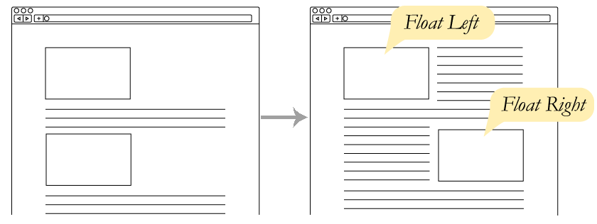
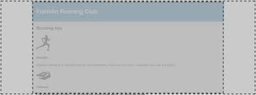
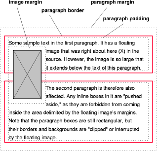
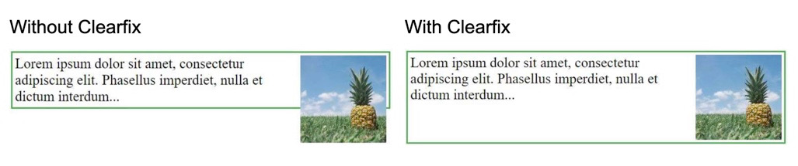
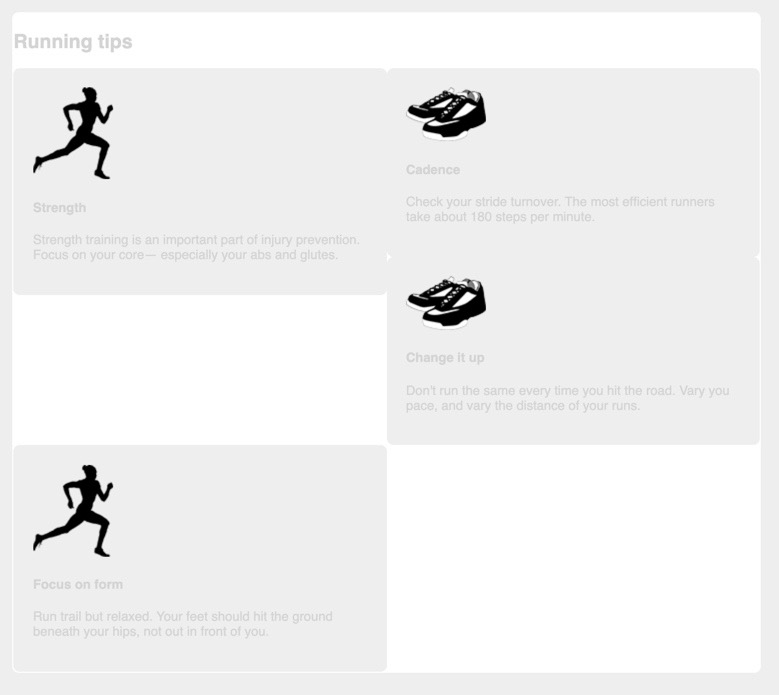

# Chapter 4 Making sense of floats

## 3 Most Important Methods to Alter Document Flow

1. Floats
2. Flexbox
3. Gird Layout

Positioning - stacking elements in front of one another

---

# Floats

- the oldest method for laying out a web page
- for 2 decades was the only option until display: inline-block and display:table emerged
- not originally intended to construct page layout but instead to format a website like a newspaper with text wrapping around



floated element
: removed from normal document flow and pulled to the edge of the container

- text flows around the float

---

# Page Structure

- It's usually easiest to lay out the large regions of a page first then work to smaller elements within

- Example #1

---

## Double Container Pattern



```html
<style>
  .container {
    /* small inner container fills the screen, larger ones expands to 1080px */
    /* important to avoid scrolling on devices with smaller screens */
    max-width: 1080px;
    /* TB RL auto left and right margins will center element in outer container */
    margin: 0 auto;
  }
</style>
<html>
  <body>
    <!-- the outer container is body and by default 100% of the page width -->
    <div class="container">
      <!-- the inner container -->
    </div>
  </body>
</html>
```

- Example #2

---

## Do we still need Floats?

- for IE, only IE 10 and 11 support flexbox
- plenty of sites out there that still use floats so good to be aware of them
- floats do require less markup
- **_only way to move an image to the side of the page and allow text to wrap around it_**

---

## Floated elements do not add height to their parent elements

- this is unlike elements in the normal document flow
- when float an image inside a paragraph the paragraph does not grow to container the image, instead the next paragraph will start immediately below



```css
/* white background doesn't extend beyond running tips */
/* floated elements do not add height to their containers */
/* so all the floated media elements are below the white background of main */
.media {
  float: left; /* float the media to the left */
  width: 50%;
  padding: 1.5em;
  background-color: #eee;
  border-radius: 0.5em;
}
```

- Example #3

---

## Clear - Float's Companion Property

- clearfix



clear (both, left, right)
: if place an element a the end of the main container and use clear causes the container to expand to the bottom of the floats

```html
<!-- at end of main causes the white background to extend -->
<!-- clear:both causes element to causes element to move below -->
<!-- bottom of floated elements instead of beside them -->
<!-- as this div is not floated container will extend it -->
<div style="clear: both"></div>
```

- this works work but is ugly, want instead to change in css
- Example #4

---

## clearfix with ::after pseudo-element

- clearfix is applied to the container of the elements that are floated

```css
/* ::after a pseudo-element targets a point in the document */
.clearfix::after {
  /* targets the pseudo-element at the end of the document */
  /* with display: block and content: ' ' value causes the pseudo-element to appear in the document */
  display: block;
  content: ' '; /* the space fixes issues in old Opera versions */
  /* clear: both makes the pseudo-element clear all floats in the document*/
  clear: both;
}
```

- Example #5

---

## clearfix refinement for margin collapsing

| margins of           | margin collapsing with clear fixed container        |
| -------------------- | --------------------------------------------------- |
| non-floated elements | will margin collapse                                |
| floated elements     | won't collapse outside of the clear fixed container |

```css
/* can also be used to prevent margin collapsing where don't want it */
.clearfix::before,
.clearfix::after {
  /* we saw that display:table-cell doesn't have margins */
  /* but the clearfix needs a block level element so use table */
  /* table implicitly adds table-row and table-cell */
  display: table;
  content: ' '; /* the space fixes issues in old Opera versions */
}

.clearfix::after {
  clear: both; /* only the ::after pseudo element needs to clear floats */
}
```

- Example #6

---

### Unexpected "float catching"

- browser places floats as high as possible


- As the first box is larger than the 2nd
  - 1st 2 floats are in a row as expected
  - But as the 2nd box is smaller than the 1st the 3rd "catches" on the 1st
  - 3rd box doesn't float all the way to the left leaves large space below 1st



- float catching can happen with even a 1px difference in heights
- if the 1st floated element is shorter then this there won't be float catching

---

### Fix for "float catching"

- the 3rd float needs to clear the floats above it
- or more generally the 1st element of each row needs to clear the float above it

```css
/* nth-child pseudo-class selector */
/* since two boxes per row the odd ones need to clear */
.media:nth-child(odd) {
  clear: left;
}
```

```css
/* if had three items per row could target every 3rd with the selector */
/* 3(0) + 1 = 1 */
/* 3(1) + 1 = 4 */
.media:nth-child(3n + 1) {
  clear: left;
}
```

- this fix only works when you know how many elements are on each row

```css
.media {
  float: left;
  /* if defined as something other than % use flexbox or inline-block elements */
  width: 50%;
  padding: 1.5em;
  background-color: #eee;
  border-radius: 0.5em;
}
```

- ## Example #7

---
