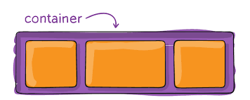
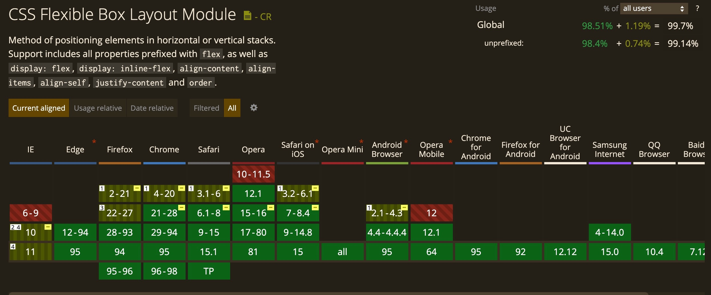
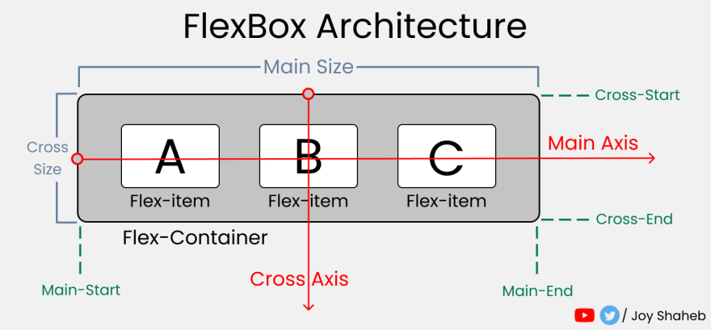
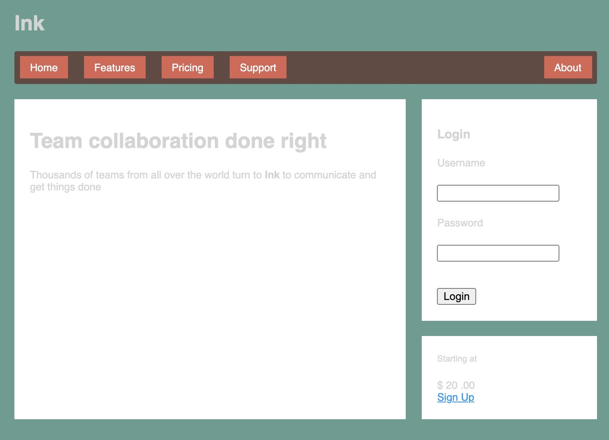
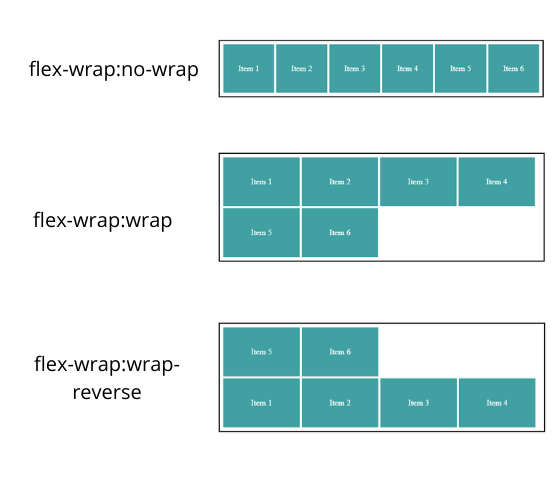
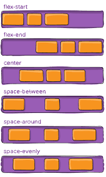
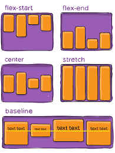
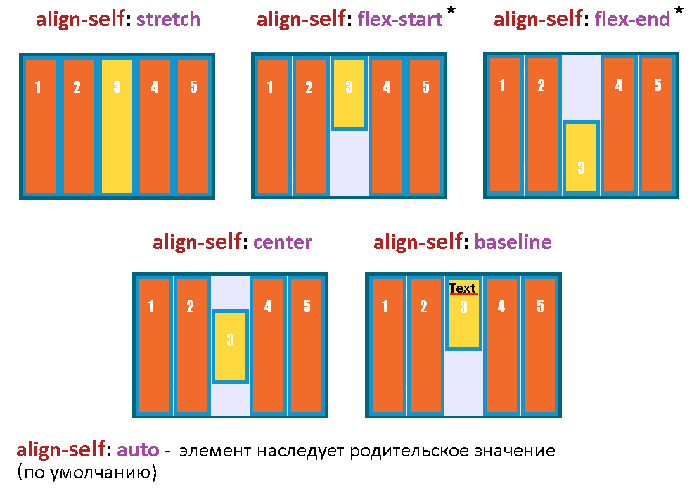

# Chapter 5 Flexbox

## Flexbox (Flexible Box Layout)

- new method for laying out elements on a page

  - more predictable and far more control than floats
  - simple solution for vertically centering and equal height columns
  - before flexbox: display values (ex. display: inline) only affected the element they were applied on
  - with flexbox: governs the layout of elements within

- default: side by side, left to right, all in one row



```css
/* direct children of flex container flex items */
.container {
  display: flex; /* a flex container */
}
```

- **_flex container_** fills the available width like a block element
- **_flex items_**
  - width may not necessarily fill width of their flex container
  - height all the same determined naturally by their contents

```css
/* inline-flex, flex items behave the same as flex */
/* width won't automatically grow to 100% acting like a inline-block element */
.container {
  display: inline-flex;
}
```

## Can I use Flexbox?



## Flexbox Architecture



### main axis and cross axis can have their direction changed

main axis
: items are placed across the main axis from main-start to main-end

cross axis
: perpendicular to the main axis is the cross axis goes from cross-start to cross-end

- NOTE: with flex-direction: column/row these will switch

---

## initialize CSS and begin styling down the page

- Example #1

---

## add flexbox

```html
<!-- which element should be flex container? -->
<!-- which elements should be the flex items? -->
<style>
  .site-nav {
    display: flex; /* flexbox container */
    padding-left: 0;
    list-style-type: none; /* user-agent uses disc */
    background-color: #5f4b44;
  }

  /* direct descendant combinator  */
  .site-nav > li {
    /* the flex items */
    margin-top: 0; /* removes the lobotomized owl */
  }

  /* direct descendant combinator followed by direct descendant combinator  */
  .site-nav > li > a {
    background-color: #cc6b5a;
    color: white;
    text-decoration: none; /* removes the underline */
  }
</style>
<!-- flex container -->
<ul class="site-nav">
  <!-- flex item -->
  <li><a href="/">Home</a></li>
  <!-- flex item -->
  <li><a href="/features">Features</a></li>
  <!-- flex item -->
  <li><a href="/pricing">Pricing</a></li>
  <!-- flex item -->
  <li><a href="/support">Support</a></li>
  <!-- flex item -->
  <li class="nav-right"><a href="/about">About</a></li>
</ul>
```

- Example #2

---

## vendor prefixes for flexbox

- browsers added vendor prefixes to support css functionality before the specification is stable
- major browsers now provide upcoming features with "experimental features" option

```css
/* example vendor prefix for Safari 8 */
.site-nav {
  display: -webkit-flex;
  display: flex; /* browsers ignore properties they don't understand */
}
```

### don't manually add vendor prefixes

- JS frameworks use Autoprefixer to generate vendor prefixes
  - Ex. in Angular the browserslist config file is used by angular cli to determine which prefixes to apply
  - Ex. NextJS uses Autoprefixer to automatically provides vendor prefixes

---

## add padding as menu buttons look scrawny

- add padding to anchor not list item as anchor is the clickable part

```css
.site-nav {
  display: flex;
  padding: 0.5em; /* add padding to menu outside of the links */
  background-color: #5f4b44;
  list-style-type: none;
  border-radius: 0.2em;
}

.site-nav > li {
  margin-top: 0;
}

.site-nav > li > a {
  /* block so adds to parent element's height */
  display: block;
  /* add padding TRBL TB .5em RL 1em */
  /* .5 * 16px = 8px on TB and 1 * 16px = 16px on RL */
  padding: 0.5em 1em;
  background-color: #cc6b5a;
  color: white;
  text-decoration: none;
}
```

### element height block vs inline

#### block element

- block level elements (such as div), with global box-sizing fix, provide a height of their contents and padding

```css
/* Global box-sizing fix */
:root {
  box-sizing: border-box;
}

*,
::before,
::after {
  box-sizing: inherit;
}
```

#### inline element

- inline elements (such as anchors) provide a height of their line-height
- we looked at line-height which should be specified as unitless so that it is re-calculated based on font-size

```css
.site-nav > li > a {
  /* block so adds to parent element's height */
  display: block;
  /* add padding TRBL TB .5em RL 1em */
  /* .5 * 16px = 8px on TB and 1 * 16px = 16px on RL */
  padding: 0.5em 1em;
  background-color: #cc6b5a;
  color: white;
  text-decoration: none;
}
```

- Example #3

---

## add margins to add space between the menu buttons

- works well when want different space between the menu buttons on left and right side
- use justify-content when want the same space between flex items

```html
<style>
  /* direct descent combinator with adjacent sibling combinator */
  /* so not the first li */
  .site-nav > li + li {
    margin-left: 1.5em; /* 1.5 * 16px = 24px of space on left */
  }

  .site-nav > .nav-right {
    /* with flexbox can use margin: auto */
    /* fill all available space margin-left pushes to the right */
    margin-left: auto;
  }
</style>
<ul class="site-nav">
  <li><a href="/">Home</a></li>
  <li><a href="/features">Features</a></li>
  <li><a href="/pricing">Pricing</a></li>
  <li><a href="/support">Support</a></li>
  <li class="nav-right"><a href="/about">About</a></li>
</ul>
```

- Example #4

```html
<style>
  /* if had wanted to move Support and About to the right */
  .site-nav > .nav-right {
    margin-left: auto;
  }
</style>
<ul class="site-nav">
  <li><a href="/">Home</a></li>
  <li><a href="/features">Features</a></li>
  <li><a href="/pricing">Pricing</a></li>
  <!-- moving the nav-right class to support -->
  <li class="nav-right"><a href="/support">Support</a></li>
  <li><a href="/about">About</a></li>
</ul>
```

- Example #5

---

## flex property

- instead of margin could have also specified size with width and height
- flexbox also has a flex property which is applied to flex items to control their size along the main axis (the width)



- divide content into 2 columns haven't specified width so will naturally resize based on content

```html
<style>
  .tile {
    padding: 1.5em; /* 1.5 * 16px = 24px padding around tile */
    background-color: #fff; /* white background */
  }

  .flex {
    display: flex;
  }

  /* direct descendant combinator with lobotomized owl */
  .flex > * + * {
    margin-top: 0; /* removes the body lobotomized owl */
    margin-left: 1.5em;
  }
</style>
<!-- flex container -->
<main class="flex">
  <!-- tile and flex item -->
  <div class="column-main tile"></div>
  <!-- flex item -->
  <!-- .flex > * + * targets this -->
  <!-- body lobotomized owl targets column-sidebar -->
  <!-- removing the top-margin and adding margin-left -->
  <div class="column-sidebar">
    <!-- tile -->
    <div class="tile"></div>
    <!-- tile -->
    <div class="tile centered"></div>
  </div>
</main>
```

- Example #6

- while this looks good, need to consider content changes and applying the stylesheet to similar pages

```html
<style>
  .column-main {
    flex: 2; /* 2/3 of the main axis (width) */
  }

  .column-sidebar {
    flex: 1; /* 1/3 of the main axis (width) */
  }
</style>
<main class="flex">
  <!-- column-main -->
  <div class="column-main tile"></div>
  <!-- column-sidebar -->
  <div class="column-sidebar">
    <div class="tile"></div>
    <div class="tile centered"></div>
  </div>
</main>
```

|--------2/3--------|----1/3----|

- Example #7

---

## flex is a shorthand property for 3 sizing properties

```css
.column-main {
  flex: 2;
}

/* equivalent to */
.column-main {
  flex: 2 1 0%;
}

/* equivalent to */
.column-main {
  flex-grow: 2;
  flex-shrink: 1;
  flex-basis: 0%;
}
```

### flex-basis

- initial main size (width) of an element
- has the same units as width ex. px, em, %

#### default value for flex-basis is auto

```css
/* when flex-basis is not specified or auto uses flex item's width */
.flex-item {
  width: 100px;
  /* value for flex-basis is 100px */
  flex-basis: auto;
}
```

```css
/* when width is not specified then flex item's sized naturally by contents */
.flex-item {
  /* no width flex items sized naturally by contents */
  flex-basis: auto;
}
```

#### when flex-basis specified width is ignored

```css
/* when flex-basis specified width ignored */
.flex-item {
  /* width ignored as flex-basis specified */
  width: 100px;
  flex-basis: 0%;
}
```

#### flex-basis is computed for each flex item with their margins may not fill the width of the flex container leaving remaining space

- example with 3 flex items and a flex-basis of 20%

- 100% - (20% \* 3) = remainder of 40%

```html
<!-- 3 flex items with a flex-basis of 20% -->
<style>
  .flex-item {
    flex-basis: 20%;
  }
</style>
<div class="flex-item"></div>
<div class="flex-item"></div>
<div class="flex-item"></div>
```

|---------20%--------|---------20%--------|---------20%--------|
--------------40% remainder--------------|

### flex-grow

- a non-negative integer that determines how flex items will consume the remaining space (remainder)

```css
/* with flex-grow of 0 flex item won't grow beyond flex-basis */
.flex-item {
  /* flex item won't grow beyond 20% of space */
  flex-grow: 0;
  flex-basis: 20%;
}
```

```html
<!-- with flex-grow of non 0 value flex items will grow beyond flex-basis to fill up remaining space -->
<style>
  .flex-item {
    flex-grow: 1;
    flex-basis: 20%;
  }
</style>
<div class="flex-item"></div>
<div class="flex-item"></div>
<div class="flex-item"></div>
```

- if any flex items have a non-zero growth factor, they will grow until all the remaining space is filled up

```html
<style>
  .flex-item-one {
    /* with flex-grow of 0, flex-item-one won't grow beyond 20% */
    flex-grow: 0;
    flex-basis: 20%;
  }
  /* flex-item-two and flex-item-three have a growth factor of 1 */
  /* they will fill the remaining space equally */
  .flex-item-two {
    flex-grow: 1;
    flex-basis: 20%;
  }
  .flex-item-three {
    flex-grow: 1;
    flex-basis: 20%;
  }
</style>
<div class="flex-item-one"></div>
<div class="flex-item-two"></div>
<div class="flex-item-three"></div>
```

|---------20%--------|-------------------40%--------------------|-------------------40%--------------------|

- if flex items have different flex-grow values these will "weight" how the remaining space is filled up

```html
<style>
  .flex-item-one {
    /* with flex-grow of 0, flex-item-one won't grow beyond 20% */
    flex-grow: 0;
    flex-basis: 20%;
  }
  .flex-item-two {
    /* with a growth factor of 2, flex-item-two will take up 2/3 of space */
    flex-grow: 2;
    flex-basis: 20%;
  }
  .flex-item-three {
    /* with a growth factor of 1, flex-item-two will take up 1/3 of space */
    flex-grow: 1;
    flex-basis: 20%;
  }
</style>
<div class="flex-item-one"></div>
<div class="flex-item-two"></div>
<div class="flex-item-three"></div>
```

|---------20%--------|-----------------------53%------------------------|---------------26%----------------|

---

## back to example #7

```html
<style>
  .column-main {
    flex: 2; /* 2/3 of the main axis (width) */
  }

  .column-sidebar {
    flex: 1; /* 1/3 of the main axis (width) */
  }
</style>
<main class="flex">
  <!-- column-main -->
  <div class="column-main tile"></div>
  <!-- column-sidebar -->
  <div class="column-sidebar">
    <div class="tile"></div>
    <div class="tile centered"></div>
  </div>
</main>
```

|--------2/3--------|----1/3----|

- expanding the shorthand flex property with a flex-basis of 0% there is a remaining space of 100% - 1.5em (for the margin between the columns)

```css
/* there is a margin-left on the second column */
.flex > * + * {
  margin-top: 0;
  margin-left: 1.5em;
}

.column-main {
  flex-grow: 2; /* 2/3 of the main axis (width) */
  flex-shrink: 1;
  flex-basis: 0%;
}

.column-sidebar {
  flex-grow: 1; /* 1/3 of the main axis (width) */
  flex-shrink: 1;
  flex-basis: 0%;
}
```

---

## **_RECOMMEND_** favor the use of the shorthand property flex

- instead of specifying individual values for flex-grow, flex-shrink, and flex-basis
  - provides useful values flex-grow 1, flex-shrink 1, flex-basis 0%
  - default values when omitting these properties might not get what expect

---

### also possible that flex-basis value causes flex items to fill up more than the main axis (width)

- example with 3 flex items and a flex-basis of 40%

- 100% - (40% \* 3 = 120%) = overflow of 20%

```html
<!-- 3 flex items with a flex-basis of 40% -->
<style>
  .flex-item {
    flex-basis: 40%;
  }
</style>
<div class="flex-item"></div>
<div class="flex-item"></div>
<div class="flex-item"></div>
```

|-------------------40%--------------------|-------------------40%--------------------|-------------------40%--------------------|-----20% overflow----|

---

## flex-shrink

- a non-negative integer that determines how flex items will shrink so that don't have overflow

```css
/* with flex-shrink of 0 flex item won't shrink beyond flex-basis */
.flex-item {
  /* flex item won't grow beyond 20% of space */
  flex-shrink: 0;
  flex-basis: 20%;
}
```

- flex items with value greater than 0 will shrink util there is no overflow, based on their shrink factor

---

## back to example #7 using flex-shrink

- as the value of flex-shrink is 1 when using the shorthand property, flex items will shrink with equal shrink factors

```html
<style>
  /* there is a margin-left on the second column */
  .flex > * + * {
    margin-top: 0;
    margin-left: 1.5em;
  }

  /* because of the space of 1.5em between the two columns */
  /* 66.67% + 33.33% = 100% will overflow by 1.5em */
  .column-main {
    flex: 66.67%;
  }

  .column-sidebar {
    flex: 33.33%;
  }
</style>
<main class="flex">
  <!-- column-main -->
  <div class="column-main tile"></div>
  <!-- column-sidebar -->
  <div class="column-sidebar">
    <div class="tile"></div>
    <div class="tile centered"></div>
  </div>
</main>
```

|--------2/3--------|----1/3----|

- expanding the shorthand property

```css
.flex > * + * {
  margin-top: 0;
  margin-left: 1.5em;
}

/* the shrink factor for each column is 1 */
/* therefore will equally shrink so that the columns no longer overflow by 1.5em */
.column-main {
  flex-grow: 1;
  flex-shrink: 1;
  flex-basis: 66.67%;
}

.column-sidebar {
  flex-grow: 1;
  flex-shrink: 1;
  flex-basis: 33.33%;
}
```

- Example #8

---

## using flex property

### define proportional columns using flex-grow (Example #7)

```html
<style>
  .column-main {
    /* flex-grow 2, flex-shrink 1, flex-basis 0% */
    flex: 2;
  }

  .column-sidebar {
    /* flex-grow 1, flex-shrink 1, flex-basis 0% */
    flex: 1;
  }
</style>
<main class="flex">
  <div class="column-main tile"></div>
  <div class="column-sidebar">
    <div class="tile"></div>
    <div class="tile centered"></div>
  </div>
</main>
```

|--------2/3--------|----1/3----|

### define proportional columns using flex-basis (Example #8)

```html
<style>
  .flex > * + * {
    margin-top: 0;
    margin-left: 1.5em;
  }

  .column-main {
    /* flex-grow 1, flex-shrink 1, flex-basis 66.67% */
    flex: 66.67%;
  }

  .column-sidebar {
    /* flex-grow 1, flex-shrink 1, flex-basis 33.33% */
    flex: 33.33%;
  }
</style>
<main class="flex">
  <div class="column-main tile"></div>
  <div class="column-sidebar">
    <div class="tile"></div>
    <div class="tile centered"></div>
  </div>
</main>
```

|--------2/3--------|----1/3----|

### define columns that grow to natural (content) widths

- flex items don't necessarily fill width of container

```html
<style>
  .flex-item {
    /* flex-grow 1, flex-shrink 1, flex-basis none */
    flex: none;
  }
</style>
<div class="flex-item"></div>
<div class="flex-item"></div>
<div class="flex-item"></div>
```

|-------flex: none-------||-------flex: none-------||-------flex: none-------|--------|

### define fixed width columns and "fluid" columns that scale with viewport

- can optionally add a max-width to prevent contents from forcing it to grow wider

```html
<style>
  .flex-item-one {
    /* flex-grow 0, flex-shrink 0, flex-basis 300px */
    flex: 0 0 300px;
    /* optional */
    max-width: 300px;
  }
  .flex-item-two {
    /* flex-grow 1, flex-shrink 1, flex-basis 0% */
    flex: 1;
  }
</style>
<div class="flex-item-one"></div>
<div class="flex-item-two"></div>
```

|-------flex: 0 0 300px-------||---------------------flex: 1-----------------|

### define "Holy Grail Layout"

- was notoriously difficult in CSS with floats and brittle hacks
- two sidebars fixed while center column is "fluid" so will grow to fill available space

```html
<style>
  .flex-item-one {
    /* flex-grow 0, flex-shrink 0, flex-basis 200px */
    flex: 0 0 200px;
  }
  .flex-item-two {
    /* flex-grow 1, flex-shrink 1, flex-basis 0% */
    flex: 1;
  }
  .flex-item-three {
    /* flex-grow 0, flex-shrink 0, flex-basis 200px */
    flex: 0 0 200px;
  }
</style>
<div class="flex-item-one"></div>
<div class="flex-item-two"></div>
<div class="flex-item-three"></div>
```

|----flex: 0 0 200px-----||--------------flex: 1---------------|----flex: 0 0 200px-----|

### define grid system (similar to Bootstrap) with flexbox

```html
<style>
  .column-1 {
    /* flex-grow 1, flex-shrink 1, flex-basis 8.3333% */
    flex: 8.3333%; /* 1/12 */
  }
  .column-2 {
    /* flex-grow 1, flex-shrink 1, flex-basis 16.6667% */
    flex: 16.6667%; /* 2/12*/
  }
  .column-3 {
    /* flex-grow 1, flex-shrink 1, flex-basis 25% */
    flex: 25%; /* 3/12 */
  }
  .column-4 {
    /* flex-grow 1, flex-shrink 1, flex-basis 33.3333% */
    flex: 33.3333%; /* 4/12 */
  }
  .column-5 {
    /* flex-grow 1, flex-shrink 1, flex-basis 41.6667% */
    flex: 41.6667%; /* 5/12 */
  }
  .column-6 {
    /* flex-grow 1, flex-shrink 1, flex-basis 50% */
    flex: 50%; /* 6/12 */
  }
  .column-7 {
    /* flex-grow 1, flex-shrink 1, flex-basis 58.3333% */
    flex: 58.3333%; /* 7/12 */
  }
  .column-8 {
    /* flex-grow 1, flex-shrink 1, flex-basis 66.6667% */
    flex: 66.6667%; /* 8/12 */
  }
  .column-9 {
    /* flex-grow 1, flex-shrink 1, flex-basis 75% */
    flex: 75%; /* 9/12 */
  }
  .column-10 {
    /* flex-grow 1, flex-shrink 1, flex-basis 83.3333% */
    flex: 83.3333%; /* 10/12 */
  }
  .column-11 {
    /* flex-grow 1, flex-shrink 1, flex-basis 91.6667% */
    flex: 91.6667%; /* 11/12 */
  }
  .column-12 {
    /* flex-grow 1, flex-shrink 1, flex-basis 100% */
    flex: 100%; /* 12/12 */
  }
</style>
<div class="column-4"></div>
<div class="column-8"></div>
```

|------flex: 33.3333%-----|-------------------flex: 66.6667%------------------|

---

## flex-direction property


- provides the ability to switch the direction of the main axis
  - the cross axis switches as well to remain perpendicular to the main axis

| flex-direction | flex items flow |            |
| -------------- | --------------- | ---------- |
| row (default)  | left to right   | horizontal |
| column         | top to bottom   | vertical   |
| row-reverse    | right to left   | horizontal |
| column-reverse | bottom to top   | vertical   |

### Add additional text to example

- Example #9
- Flexbox is supposed to provide columns of equal height so why isn't this working?

```css
/* temporarily adding border */
/* columns really are the same height */
.column-sidebar {
  border: 1px dotted #fff;
}
```

- Example #10

- the flex items are the same height but want the right flex item to grow to fill it (before flexbox without JS this was impossible)

```css
.column-main {
  flex: 2;
}

/* create nested flexbox */
.column-sidebar {
  flex: 1; /* flex 1 for the column */
  display: flex; /* make this column flex container */
  /* rotate main axis so that flex items flow vertically top to bottom */
  flex-direction: column;
}

/* direct descendant combinator */
.column-sidebar > .tile {
  /* flex-grow 1, flex-shrink 1, flex-basis 0% applied to flex item height */
  flex: 1; /* flex items will grow to fill the remaining space (remainder)   */
}
```

### in CSS working with heights is fundamentally different than widths

- with flex: 1, flex items will grow to fill the remaining space (remainder)

  - with row (row-reverse), flex container will be 100% the available width
  - with column (column-reverse), flex container height determined naturally by its contents

- in a vertical flexbox flex-grow and flex-shrink have no effect unless something else gives the flex container a height

  - in this case its the outer flex container that is providing the height

- Example #11

---

### styling the form

- the form has the class login-form so use it to target the CSS

```html
<style>
  .login-form h3 {
    margin: 0;
    font-size: 0.9em;
    font-weight: bold;
    text-align: right;
    /* preferred over capitalizing in HTML as style decision */
    text-transform: uppercase;
  }

  .login-form input:not([type='checkbox']):not([type='radio']) {
    display: block;
    width: 100%;
    margin-top: 0;
  }

  .login-form button {
    margin-top: 1em;
    border: 1px solid #cc6b5a;
    background-color: white;
    /* more vertical than horizontal spacing aesthetically pleasing */
    padding: 0.5em 1em;
    cursor: pointer; /* hand with pointing finger mouse cursor */
  }
</style>
<div class="tile">
  <form class="login-form">
    <!-- 1st part title -->
    <h3>Login</h3>
    <!-- 2nd part input fields -->
    <p>
      <label for="username">Username</label>
      <input id="username" type="text" name="username" />
    </p>
    <p>
      <label for="password">Password</label>
      <input id="password" type="password" name="password" />
    </p>
    <!-- 3rd part button -->
    <button type="submit">Login</button>
  </form>
</div>
```

---

## HTML Input Elements

- HTML Input Elements are peculiar in CSS

```css
/* not pseudo-class wth attribute selector */
.login-form input:not([type='checkbox']):not([type='radio']) {
  display: block; /* so input elements displayed on own line */
  width: 100%;
  margin-top: 0; /* remove lobotomized owl */
}
```

### input:not([type='checkbox']):not([type='radio'])

- blacklist approach styling all input elements that are not checkboxes or radio buttons
- whitelist approach of listing all input elements would be lengthy
- although the form only uses text and password inputs should consider future changes

### display: block and width:100%

- although block (display: block) elements normally fill available width
  - input elements width is determined by size attribute

input element size attribute
: number of characters it should contain without scrolling, has default size value but and override by specifying width

- Example #12

---

## all properties for flexbox

- when working with flexbox:

1. use display: flex to specify the container
2. use flex-direction if needed
3. use margins and/or flex values for the flex items for size
4. use additional properties for flexbox (occasionally needed)

### all flex container properties

#### flex-direction


- specifies the direction of the main axis, the cross axis will be perpendicular

| flex-direction      |
| ------------------- |
| row (initial value) |
| column              |
| row-reverse         |
| column-reverse      |

#### flex-wrap



- wrap flex items to a new row for flex-direction row (or row-reverse)
- wrap flex items to a new column for flex-direction column (or column-reverse)

| flex-wrap               |                                        |
| ----------------------- | -------------------------------------- |
| no-wrap (initial value) | flex container's align-content ignored |
| wrap                    | flex item's flex-shrink value ignored  |
| wrap-reverse            | flex item's flex-shrink value ignored  |

- instead of using flex item's flex-shrink value wraps the flex item to the next row or column

- with flex-direction: column (or column-reverse)
  - flex-wrap will allow the flex items to overflow into a new column
  - however: only if something constrains height of flex container, otherwise the flex container will grow to contain its flex items

#### flex-flow

- flex-flow is a shorthand for flex-direction flex-wrap

```css
.flex-item {
  /* will wrap if something constrains the height of the container */
  flex-flow: column wrap;
}

/* equivalent to */
.flex-item {
  flex-direction: column;
  /* will wrap if something constrains the height of the container */
  flex-wrap: wrap;
}
```

#### justify-content



- how flex items are spaced along the main axis if they don't fill the size of the container
- spacing applied after margins and flex-grow values are calculated
- therefore justify-content will have no effect when:
  - any flex items have a flow-grow value other than 0
  - any items have auto margin on the main axis

##### justify-content values

| justify-content            |
| -------------------------- |
| flex-start (initial value) |
| flex-end                   |
| center                     |
| space-between              |
| space-around               |
| space-evenly               |

**flex-start (initial value)**
: flex items at beginning of main axis with no space between them unless margins specified

**space-between**
: 1st flex item at beginning of main axis and last at end, remaining items are positioned evenly between them

**space-around**
: like space-between but also adds even spacing before the 1st and after the last

#### align-items



- how flex items are spaced along the cross axis

| align-items             |
| ----------------------- |
| flex-start              |
| flex-end                |
| center                  |
| stretch (initial value) |
| baseline                |

stretch (initial value)
: all flex items will fill the height of the flex container or the width if flex-direction of column (column-reverse)

flex-start
: flex items along the start of the cross axis (top of a row)

flex-end
: flex items along the end of the cross axis (bottom of a row)

baseline
: aligns the flex items so that the baseline of their text aligns

- useful when want to align a large title with the text of a subtitle

#### align-content


- analogous to justify-content except for wrapped content along the cross axis
- only works when wrap (or wrap-reverse) specified

| align-content           |
| ----------------------- |
| flex-start              |
| flex-end                |
| center                  |
| stretch (initial value) |
| space-between           |
| space-around            |

### all flex items properties

#### flex-grow

- integer "growth factor", how much flex item will grow along the main axis to fill remaining spacing

#### flex-shrink

- integer "shrink factor", how much flex item will shrink along the main axis to prevent overflow
- wil not be used if flex-wrap is set on flex container

#### flex-basis

- initial size of the item before flex-grow or flex-shrink is applied

#### flex

- flex is a shorthand for flex-grow flex-shrink flex-basis

```css
.flex-item {
  flex: 1;
}

/* equivalent to */
.flex-item {
  flex-grow: 1;
  flex-shrink: 1;
  flex-basis: 0%;
}
```

#### align-self



- same as align-items except with ability to specify how flex items are spaced along the cross axis individually

- ignored if the flex item has margin auto set on the cross axis
  - ex. for flex-direction row this would be margin-top: auto, margin-bottom: auto as the cross axis is vertical

| align-self           |                                                  |
| -------------------- | ------------------------------------------------ |
| auto (initial value) | defers to the flex-container's align-items value |
| flex-start           |                                                  |
| flex-end             |                                                  |
| center               |                                                  |
| stretch              |                                                  |
| baseline             |                                                  |

#### order

| order             |                                            |
| ----------------- | ------------------------------------------ |
| 0 (initial value) | flex item laid out in order of HTML source |
| negative integer  | flex item moved to beginning               |
| positive integer  | flex item moved to end                     |

- **_WARNING_** tab order in browser and screen readers may still read out the flex items in HTML source order

---

## Example using additional HTML properties

```html
<style>
  .centered {
    text-align: center;
  }

  .cost {
    display: flex; /* flex container */
    justify-content: center; /* all flex items centered on main axis */
    align-items: center; /* all flex items centered on cross axis */
    /* flex items are inline so line-height and font-size determines height */
    /* 0.7 derived by trial and error so tops of 20 and .00 aligned visually */
    line-height: 0.7;
  }

  /* direct descendant combinator, the 3 spans */
  .cost > span {
    margin-top: 0; /* removal of body lobotomized owl */
  }

  /* set font sizes for each flex item */
  .cost-currency {
    font-size: 2rem;
  }

  .cost-dollars {
    font-size: 4rem;
  }

  .cost-cents {
    font-size: 1.5rem;
    align-self: flex-start; /* moves to the top of the flex container */
  }

  /* call to action button */
  .cta-button {
    display: block;
    background-color: #cc6b5a;
    color: white;
    padding: 0.5em 1em; /* more padding horizontally than vertically */
    text-decoration: none;
  }
</style>
<div class="tile centered">
  <small>Starting at</small>
  <div class="cost">
    <span class="cost-currency">$</span>
    <span class="cost-dollars">20</span>
    <span class="cost-cents">.00</span>
  </div>
  <a class="cta-button" href="/pricing">Sign Up</a>
</div>
```

- Example #13

---

## Flex bugs

- implementation of flexbox isn't perfect in all browsers especially IE 10 and 11 flexbugs repo has the issues and how to fix for older browsers
- [Flexbugs](https://github.com/philipwalton/flexbugs)

---

## Full-page layout

- one issue 3 columns (flex-direction: row), as browser progressively loads data it could render 2 columns first and then when full site loads recalculate and display the 3 column layout
- **_RECOMMEND_** using CSS grid instead of flexbox for full page layout

---
