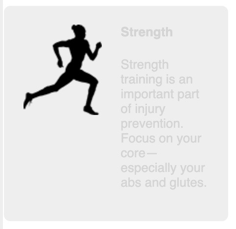
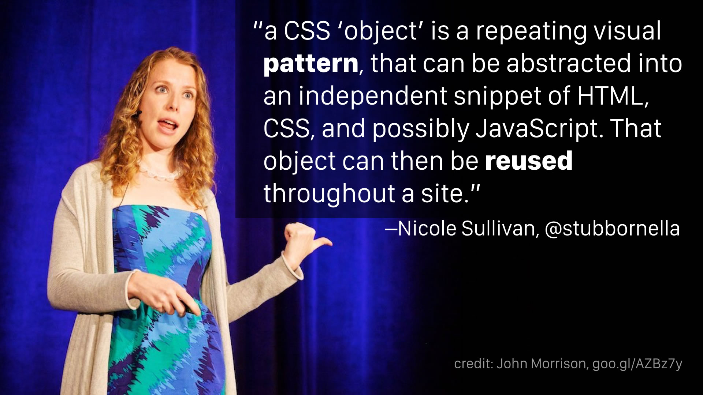
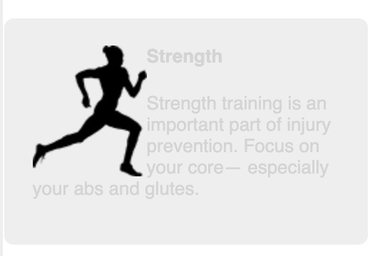
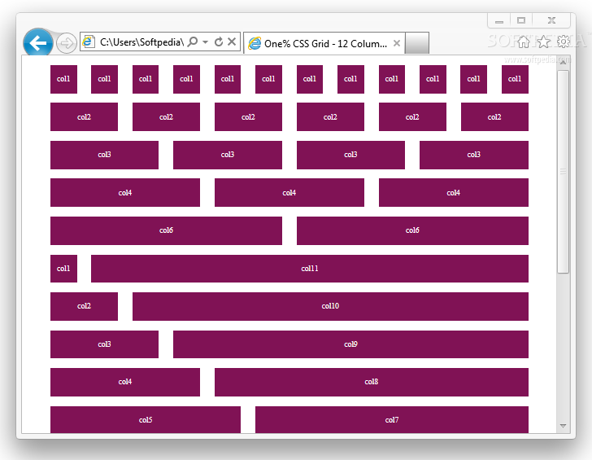

# Chapter 4 Continued Making sense of floats

## Unexpected "float catching"

- browser places floats as high as possible


- As the first box is larger than the 2nd
  - 1st 2 floats are in a row as expected
  - But as the 2nd box is smaller than the 1st the 3rd "catches" on the 1st
  - 3rd box doesn't float all the way to the left leaves large space below 1st


- float catching can happen with even a 1px difference in heights
- if the 1st floated element is shorter then this there won't be float catching

---

## Fix for "float catching"

- the 3rd float needs to clear the floats above it
- or more generally the 1st element of each row needs to clear the float above it

```css
/* nth-child pseudo-class selector */
/* since two boxes per row the odd ones need to clear */
.media:nth-child(odd) {
  clear: left;
}
```

```css
/* if had three items per row could target every 3rd with the selector */
/* 3(0) + 1 = 1 */
/* 3(1) + 1 = 4 */
.media:nth-child(3n + 1) {
  clear: left;
}
```

- this fix only works when you know how many elements are on each row

```css
.media {
  float: left;
  /* if defined as something other than % use flexbox or inline-block elements */
  width: 50%;
  padding: 1.5em;
  background-color: #eee;
  border-radius: 0.5em;
}
```

- Example #8

---

## Adding margin

- adding right margin to create a gutter between media elements
- Lobotomized owl

```css
/* Lobotomized owl */
body * + * {
  margin-top: 1.5em;
}
```

```html
<style>
  .media {
    float: left;
    /* T of 0 removes the lobotomized owl all but the top media have 1.5em top margin */
    margin: 0 1.5em 1.5em 0; /* TRBL R and B have 1.5em of margin */
    /* as want a margin but 50% media is now to wide (1.5 * 16px = 24px) on the right */
    /* so subtract from the width */
    width: calc(50% - 1.5em);
    padding: 1.5em;
    background-color: #eee;
    border-radius: 0.5em;
  }
</style>

<div>
  <!-- the parent of the other media elements -->
  <div class="media"></div>
  <div class="media"></div>
  <!-- lobotomized owl targets -->
  <div class="media"></div>
  <!-- lobotomized owl targets -->
  <div class="media"></div>
  <!-- lobotomized owl targets -->
</div>
```

- Display example #9 and #10 in Chrome to show margins and computed margins
- Example #9
- Example #10

---

## "Media Object" Pattern

```html
<style></style>
<!-- Media Object pattern -->
<div class="media">
  <!-- media-image -->
  
  <!-- media-body -->
  <div class="media-body">
    <h4>Change it up</h4>
    <p>
      Don't run the same every time you hit the road. Vary your pace, and vary
      the distance on your runs.
    </p>
  </div>
</div>
```

- want to style so that it looks like this



- Nicole Sullivan
  - has named the following page layout pattern the "Media Object" Pattern
  - quote on Object Oriented CSS which will cover in the next Master's CSS course



### 1st: Float the image and handle the margins

```html
<style>
  /* float the image to the left */
  .media-image {
    float: left;
  }

  /* removes the lobotomized owl */
  .media-body {
    margin-top: 0;
  }

  /* overrides the top margin applied by user agent styles */
  .media-body h4 {
    margin-top: 0;
  }
</style>
```

- text still wraps the image due to standard document flow



- Display example #11 in Chrome to show Media Object box enveloping floated image
- Example #11

### 2nd Block Formatting Context BFC

> block formatting context (BFC)
> : region in the page in which elements are laid out isolating contents from outside context

- 3 things necessary to establish the block formatting context

1. contain the top and bottom margins of all elements within it so margins don't collapse outside their containers (won't margin collapse)
2. contain the floated element within it
3. doesn't overlap with floated elements outside the BFC

### How to create a Block Formatting Context BFC

| declaration            |                                       | issues                                                                                          |
| ---------------------- | ------------------------------------- | ----------------------------------------------------------------------------------------------- |
| float: left            | float: none will not crete BFC        | will grow to 100% so have to restrict width so doesn't line wrap below the float                |
| float: right           |                                       | will grow to 100% so have to restrict width so doesn't line wrap below the float                |
| overflow: hidden       | overflow: visible will not create BFC |                                                                                                 |
| overflow: auto         | overflow: auto (or hidden) easiest    |                                                                                                 |
| overflow: scroll       |                                       |                                                                                                 |
| display: inline-block  | called a block container              | will grow to 100% so have to restrict width so doesn't line wrap below the float                |
| display: table-cell    | called a block container              | will only grow enough to contain contents have to set large width to force fill remaining space |
| display: table-caption | called a block container              |                                                                                                 |
| display: flex          | called a block container flexbox      |                                                                                                 |
| display: inline-flex   | called a block container              |                                                                                                 |
| display: grid          | called a block container grid         |                                                                                                 |
| display: inline-grid   | called a block container              |                                                                                                 |
| position: absolute     |                                       |                                                                                                 |
| position: fixed        |                                       |                                                                                                 |

```html
<style>
  .media-image {
    float: left;
    /* adds a right margin to the image to add space */
    margin-right: 1.5em;
  }

  .media-body {
    overflow: auto; /* create a block formatting context BFC */
    margin-top: 0;
  }
</style>
```

- contents from one BFC in some cases can overlap the contents of another

  - ex. contents overflow the container (content is too wide)
  - ex. negative margins pull the contents out of the container

- Example #12

---

## Grid Systems

- most popular CSS frameworks (such as Bootstrap) include a grid system

  - put a row container around several column containers with classes indicating widths
  - the containers don't add styles instead add elements to containers for styles

- usually 12 columns in each row, each column can vary from 1 to 12 columns wide, each rows columns add up to 12

| lots of multipliers | total |
| -------------------------------- | --x--- |
| 3 x 4 column elements | 12 |
| 4 x 3 column elements | 12 |
| 1 4 column + 1 8 column | 12 |
| 9 column main + 3 column sidebar | 12 |



```css
<div class="row">
  <div class="column-4">4 column</div>
  <div class="column-8">8 column</div>
</div>
```

```css
/* this is the clearfix with ::after pseudo-element */
/* adds a clearfix for every row, a wrapper for the columns */
.row::after {
  content: ' ';
  display: block;
  clear: both;
}

/* attribute selector targeting elements on class attribute */
/* target all elements with a class attribute that starts with "column-"*/
/* consider column a reserved word after this as would also target column-header */
[class*='column-'] {
  float: left;
}

.column-1 {
  width: 8.3333%; /* 1/12 */
}
.column-2 {
  width: 16.6667%; /* 2/12*/
}
.column-3 {
  width: 25%; /* 3/12 */
}
.column-4 {
  width: 33.3333%; /* 4/12 */
}
.column-5 {
  width: 41.6667%; /* 5/12 */
}
.column-6 {
  width: 50%; /* 6/12 */
}
.column-7 {
  width: 58.3333%; /* 7/12 */
}
.column-8 {
  width: 66.6667%; /* 8/12 */
}
.column-9 {
  width: 75%; /* 9/12 */
}
.column-10 {
  width: 83.3333%; /* 10/12 */
}
.column-11 {
  width: 91.6667%; /* 11/12 */
}
.column-12 {
  width: 100%; /* 12/12 */
}
```

- Example #13

- adjust media element as still floating left and the grid columns are now doing this

```css
.media {
  /* float: left; no longer need float left as grid column already does */
  /* margin: 0 1.5em 1.5em 0; no longer need the margins */
  /* width: calc(50% - 1.5em); no longer need as will naturally fill 100% of container */
  padding: 1.5em;
  background-color: #eee;
  border-radius: 0.5em;
}

/* also no longer need for float catching due to grid column
.media:nth-child(odd) {
  clear: left;
} */
```

- Example #14

- as all margin removed from .media there is no longer the 1.5 bottom margin

```css
.main {
  /* TRBL Change from RL padding to have 1.5em B padding as well */
  padding: 0 1.5em 1.5em;
  background-color: #fff;
  border-radius: 0.5em;
}
```

- removing the margin and width calc from .media also removed the gutter

```css
[class*='column-'] {
  float: left;
  /* adding padding to grid system instead of individual components */
  /* can reuse the grid without worry about gutters again */
  padding: 0 0.75em; /* TRBL want 1.5 em of space so add 0.75 em to R & L */
  margin-top: 0; /* remove lobotomized owl */
}
```

- Example #15

- compensate for the padding on the left and right of the rows
- this is the double container pattern where the row is the inner container inside its wrapper

```css
/* use negative margins to */
/* pull the row left outside its container for the 1st and 3rd media element */
/* pull the row right outside its container for the 2nd and 4th media element */
.row {
  margin-left: -0.75em;
  margin-right: -0.75em;
}
```

- Example #16
