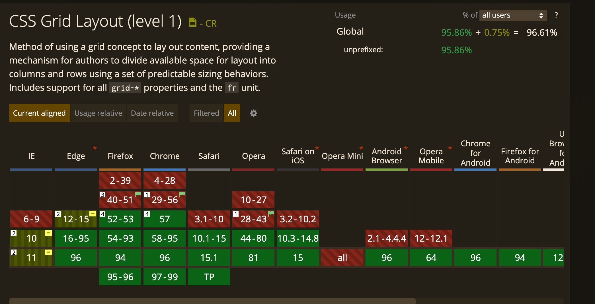
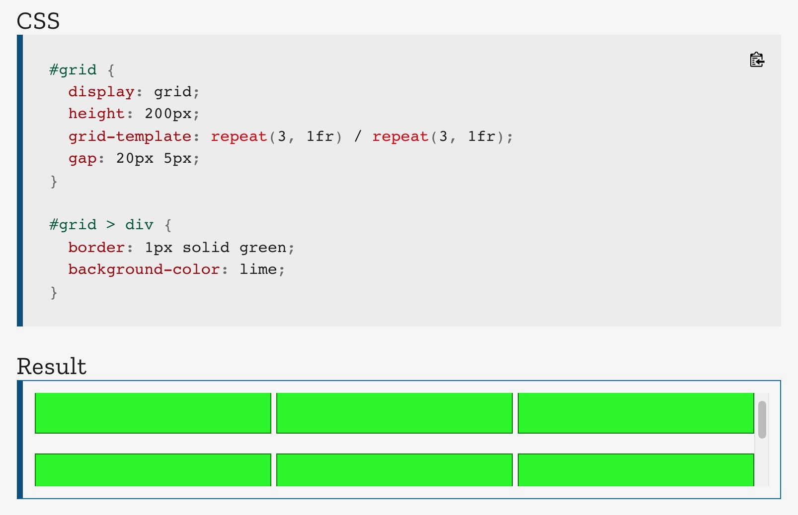
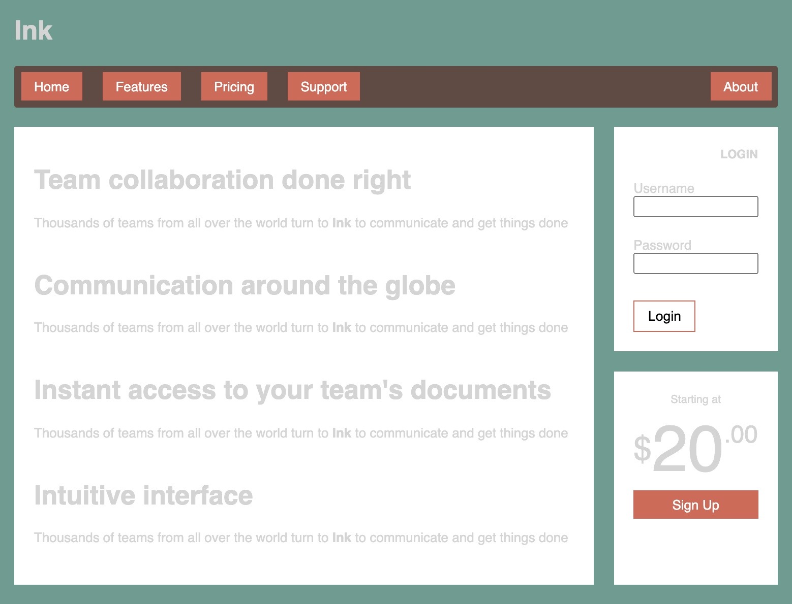
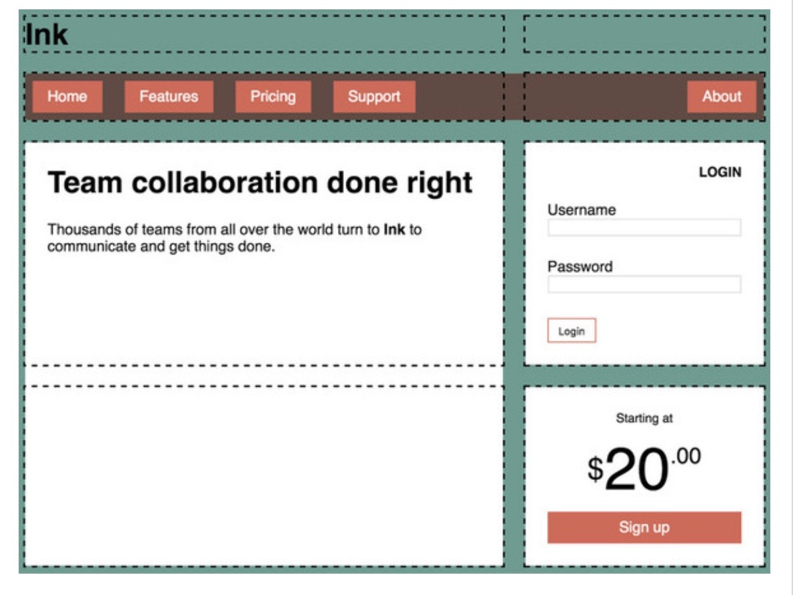
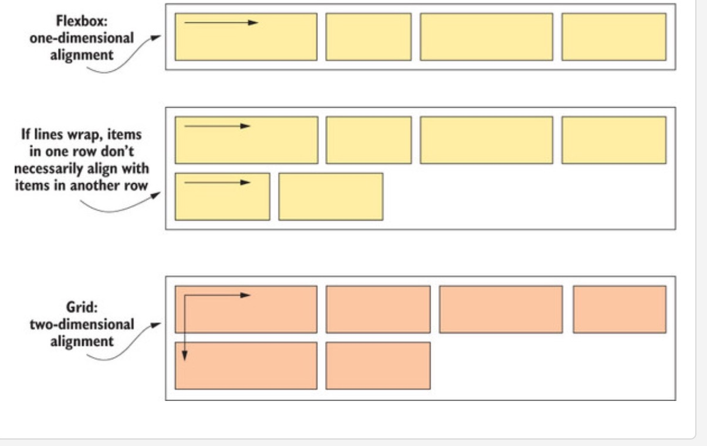
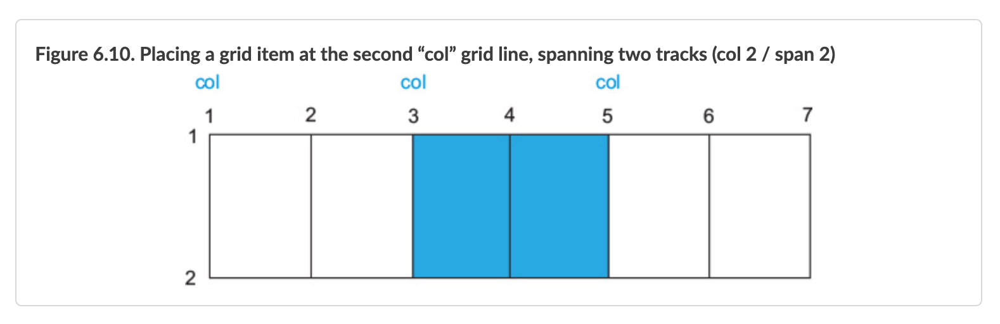

# Chapter 6 Grid Layout Module

- along with Flexbox provide a full-featured layout engine for the web
- CSS Grid allows you define a two dimensional layout of columns and rows and then place items in the grid

---

## Until March 2017 CSS Grid was an experimental feature

- within 3 months browser support grew from 0 to 70%
- how was this done? Instead of vendor prefixes, CSS Grid was provided as an experimental feature that had to be enabled to use
  - allowed developers to try out and report bugs
  - issue with vendor prefixes is that when browsers fully support the feature without vendor prefixes developers still have to use vendor prefixes to support older browsers
- However, IE 10 and 11 used vendor prefixes, so still need to use Autoprefixer

### How to enable Experimental Features?

- chrome://flags
- opera://flags
- Firefox and Safari provide developer builds of their browser



---

## Building a Basic Grid

- as with Flexbox, Grid Layout applies to 2 levels of the DOM hierarchy

1. grid container
2. grid items

```html
<style>
  .grid {
    display: grid; /* grid container */
    /* 3 columns of equal width */
    grid-template-columns: 1fr 1fr 1fr; /* fraction units */
    /* 2 rows of equal height */
    grid-template-rows: 1fr 1fr; /* fraction units */
    gap: 0.5em; /* gutter between each grid cell */
  }

  .grid > * {
    background-color: darkgray;
    color: white;
    padding: 2em;
    border-radius: 0.5em;
  }
</style>
<!-- grid container -->
<!-- behaves like a block display element filling 100% of available width -->
<div class="grid">
  <!-- Grid container's children become the grid items -->
  <div class="a">a</div>
  <div class="b">b</div>
  <div class="c">c</div>
  <div class="d">d</div>
  <div class="e">e</div>
  <div class="f">f</div>
</div>
```

---

## grid container

### display: grid vs display: inline-grid

grid
: behaves like a block: display element filling 100% of available width

inline-grid
: element flows inline and only as wide as necessary to contain children

- inline-grid is not used as often

### grid-template-columns and grid-template-rows

- define the size of each of the columns and rows in the grid

### unit fr (fraction unit)

- a new unit that represents that behaves like flex-grow in flexbox

```css
.grid {
  display: grid;
  /* 3 columns of equal width */
  grid-template-columns: 1fr 1fr 1fr; /* fraction units */
  /* 2 rows of equal height */
  grid-template-rows: 1fr 1fr; /* fraction units */
  gap: 0.5em;
}
```

- can also use other measures such as px, em, percent

```css
.grid {
  display: grid;
  /*300px fixed followed by column that grows to fill remaining space */
  grid-template-columns: 300px 1fr;
  /* 1st row is 2x as high as 2nd row */
  grid-template-rows: 2fr 1fr;
  gap: 0.5em;
}
```

- can use auto so will grow as necessary to fill its contents

```css
.grid {
  display: grid;
  /* auto will be as wide as necessary to fit contents */
  /* the second column will fill the remaining space */
  grid-template-columns: auto 1fr;
  /* 1st row is 2x as high as 2nd row */
  grid-template-rows: 2fr 1fr;
  gap: 0.5em;
}
```

### repeat function

- can use repeat() function to declare multiple or define a pattern
- repeat() shorthand makes it easier to read than longhand

#### declare multiple

```css
.grid {
  display: grid;
  grid-template-columns: 2fr 1fr;
  grid-template-rows: repeat(4, auto);
  gap: 1.5em;
}

/* equivalent to */

.grid {
  display: grid;
  grid-template-columns: 2fr 1fr;
  grid-template-rows: auto auto auto auto;
  gap: 1.5em;
}
```

#### repeating pattern

```css
.grid {
  display: grid;
  grid-template-columns: repeat(3, 2fr 1fr);
  grid-template-rows: 1fr 1fr;
  gap: 1.5em;
}

/* equivalent to */

.grid {
  display: grid;
  grid-template-columns: 2fr 1fr 2fr 1fr 2fr 1fr;
  grid-template-rows: 1fr 1fr;
  gap: 1.5em;
}
```

|------- 2fr -------|-- 1fr --|------- 2fr -------|-- 1fr --|------- 2fr -------|-- 1fr --|

```css
.grid {
  display: grid;
  grid-template-columns: 1fr repeat(3, 3fr) 1fr;
  grid-template-rows: 1fr 1fr;
  gap: 1.5em;
}

/* equivalent to */

.grid {
  display: grid;
  grid-template-columns: 1fr 3fr 3fr 3fr 1fr;
  grid-template-rows: 1fr 1fr;
  gap: 1.5em;
}
```

|-- 1fr --|---------- 3fr ----------|---------- 3fr ----------|---------- 3fr ----------|-- 1fr --|

### gap (grid-gap) property

- defines the amount of space to add to the gutter between each grid cell

## gap is a shorthand property for 2 sizing properties row-gap and column-gap

```css
.grid {
  display: grid;
  grid-template-columns: 1fr 1fr 1fr;
  grid-template-rows: 1fr 1fr;
  /* gap a shorthand property */
  gap: 0.5em;
}

/* equivalent to */
.grid {
  display: grid;
  grid-template-columns: 1fr 1fr 1fr;
  grid-template-rows: 1fr 1fr;
  gap: 0.5em 0.5em;
}

/* equivalent to */
.grid {
  display: grid;
  grid-template-columns: 1fr 1fr 1fr;
  grid-template-rows: 1fr 1fr;
  row-gap: 0.5em;
  column-gap: 0.5em;
}
```

- **NOTE** gap favored over grid-gap (which the book uses)
  - row-gap favored over grid-row-gap
  - column-gap favored over grid-column-gap



---

4 grid terms

1. grid line: defines structure of the grid

   - gap if defined lies above the grid line (the gutter)

2. grid track: space between two adjacent grid lines

- horizontal tracks: rows
- vertical tracks: columns

3. grid cell: single space on the grid where a horizontal and vertical track overlap

4. grid area: rectangular area on the grid made up of one or more grid cells
   - the area is between 2 vertical grid lines and 2 horizontal grid lines

```css
.grid {
  display: grid;
  /* 5 vertical grid tracks of equal width */
  /* 6 vertical grid lines */
  grid-template-columns: 1fr 1fr 1fr 1fr 1fr;
  /* 5 horizontal grid tracks of equal height */
  /* 6 horizontal grid lines */
  grid-template-rows: 1fr 1fr 1fr 1fr 1fr;
  gap: 0.5em;
}
```


---

## Designing Page with CSS Grid instead of Flexbox



### With flexbox have to nest elements in HTML

- nav items were list items with display:flex on the ul
- there were 2 divs within a div to provide the columns
- the second column div contained two tiles and used flex-direction: column

```html
<main class="flex">
  <div class="column-main tile"></div>
  <div class="column-sidebar">
    <div class="tile"></div>
    <div class="tile centered"></div>
  </div>
</main>
```

### With grid the HTML is flattened

- each item placed on the grid must be a child of the grid container

```html
<style>
  /* apply background color and the padding for the tiles */
  .tile {
    padding: 1.5em;
    background-color: #fff;
  }

  .tile > :first-child {
    /* ensure the top of tiles line up */
    margin-top: 0;
  }

  .tile * + * {
    margin-top: 1.5em;
  }
</style>
<!-- grid container -->
<div class="container">
  <!-- grid item -->
  <header></header>
  <!-- grid item -->
  <nav></nav>
  <!-- grid item -->
  <main class="main tile"></main>
  <!-- grid item -->
  <div class="sidebar-top tile"></div>
  <!-- grid item -->
  <div class="sidebar-bottom tile centered"></div>
</div>
```

- Example #2

---

## Building the page layout from outside in



### Define the grid tracks

```html
<style>
  .container {
    display: grid;
    /* 2 vertical grid tracks defined with fraction units */
    grid-template-columns: 2fr 1fr;
    /* 4 horizontal grid tracks of size auto */
    grid-template-rows: repeat(4, auto);
    gap: 1.5em;
    /* double-container to center page contents */
    max-width: 1080;
    margin: 0 auto;
  }
</style>
<div class="container">
  <header></header>
  <nav></nav>
  <main class="main title"></main>
  <div class="sidebar-top title"></div>
  <div class="sidebar-bottom tile centered"></div>
</div>
```

- Example #3

- although the grid tracks have been defined the grid items not where we want them

### Place each grid item into a specific location on the grid

- the combination of grid-column and grid-row define the grid area of a grid item


```css
header,
nav {
  /* span from vertical grid line 1 to 3 (the 2 columns) */
  grid-column: 1 / 3;
  /* spans exactly 1 horizontal grid track (row) */
  grid-row: span 1;
}

.main {
  /* span from vertical grid line 1 to 2 (the 1st column) */
  grid-column: 1 / 2;
  /* span from horizontal grid line 3 to 5 (the last 2 rows) */
  grid-row: 3 / 5;
}

.sidebar-top {
  /* span from vertical grid line 2 to 3 (the 2nd column) */
  grid-column: 2 / 3;
  /* span from horizontal grid line 3 to 4 (the 3rd row) */
  grid-row: 3 / 4;
}

.sidebar-bottom {
  /* span from vertical grid line 2 to 3 (the 2nd column) */
  grid-column: 2 / 3;
  /* span from horizontal grid line 4 to 5 (the 4th row) */
  grid-row: 4 / 5;
}
```

---

## grid-column and grid-row are shorthand properties

- forward slash only used in the shorthand form and spaces around forward slash are optional

```css
.main {
  grid-column: 1 / 2;
  grid-row: 3 / 5;
}

/* equivalent to */

.main {
  grid-column: 1/2;
  grid-row: 3/5;
}

/* equivalent to */

.main {
  grid-column-start: 1;
  grid-column-end: 2;
  grid-row-start: 3;
  grid-row-end: 5;
}
```

### span

- can be used with grid-column and grid-row for the grid item to span one track

---

## placement algorithm (auto-placement)

- positions items to fill the first available space on the grid where they fit

```css
header,
nav {
  grid-column: 1 / 3;
  /* doesn't specify what row to place the header or nav  */
  /* positions items to fill the first available space on the grid where they fit */
  grid-row: span 1;
}
```

- Example #4

---

## Are flexbox and grid competing layout methods?

- No, they're complementary

| flexbox                         | grid                   |
| ------------------------------- | ---------------------- |
| 1 dimension                     | 2 dimension            |
| content determines space needed | layout and place items |

- sure flexbox can wrap but it can't place elements in relation to another



### main regions of page - use Grid

- layout the main regions of the page with grid because want the contents to adhere to the grid as its defined

### nav menu - use Flexbox

- allow the contents to have a greater influence on the outcome, items with more text can be wider and items with less text can be narrower
- also it's horizontal (one-dimensional) layout

### use Flexbox for the other items on the page

- Example #5

---

## use Flexbox for the other items on the page

- use grid when CSS alignment calls for 2 dimensions
- use flexbox when only concerned with one-directional flow
- **_Generally_** use grid for high-level page layout and flexbox for elements within each grid area
- Example #5

---


## alternative syntaxes

- in some designs syntax may be easier to read and understand named vs numbered lines

### named grid lines

```css
/* 2 columns with 3 named vertical grid lines start, center, and end */
.container {
  display: grid;
  grid-template-columns: [start] 2fr [center] 1fr [end];
}

/* header grid item that spans from grid line 1 (start) to grid line 3 (end) */
header {
  grid-column: start / end;
}
```

### named grid area

- naming grid lines left-start and left-end defined an area called left that spans between them

```css
.container {
  display: grid;
  /* 2 columns with 3 vertical grid lines left-start, left-end right-start, right-end */
  grid-template-columns: [left-start] 2fr [left-end right-start] 1fr [right-end];
  /* 4 horizontal grid tracks of size auto */
  /* longhand form would be [row] auto [row] auto [row] auto [row] auto */
  /* so each grid row line is named except for the last one */
  grid-template-rows: repeat(4, [row] auto);
  gap: 1.5em;
  /* double-container to center page contents */
  max-width: 1080px;
  margin: 0 auto;
}

header,
nav {
  grid-column: left-start / right-end;
  /* using placement algorithm (auto-placement) to position item
  to fill the first available space on the grid where they fit */
  grid-row: span 1;
}

.main {
  /* a named area, spans between left-start and left-end */
  grid-column: left;
  /* 3rd grid line named row then spans 2 horizontal grid tracks */
  grid-row: row 3 / span 2;
}

.sidebar-top {
  /* grid column right area between right-start and right-end */
  grid-column: right;
  grid-row: 3 / 4;
}

.sidebar-bottom {
  /* grid column right area between right-start and right-end */
  grid-column: right;
  grid-row: 4 / 5;
}
```

- Example #6

---

## using named grid lines



```css
.grid-container {
  display: grid;
  /* long hand would be [col] 1fr 1fr [col] 1fr 1fr [col] 1fr 1fr */
  grid-template-columns: repeat(3, [col] 1fr 1fr);
}

.grid-item {
  /* starting with the 2nd named col line spanning 2 columns */
  grid-column: col 2 / span 2;
}
```

---

## named grid areas

- can use named areas to position items in a grid
- the areas much form a rectangle

```css
.container {
  display: grid;
  /* draw a visual representation of the grid "ASCII art" syntax */
  grid-template-areas:
    'title title'
    'nav nav'
    'main aside1'
    'main aside2';
  /* define the track sizes as before */
  grid-template-columns: 2fr 1fr;
  grid-template-rows: repeat(4, auto);
  gap: 1.5em;
  /* double-container */
  max-width: 1080px;
  margin: 0 auto;
}

header {
  /* grid item in title grid area */
  grid-area: title;
}

nav {
  /* grid item in nav grid area */
  grid-area: nav;
}

.main {
  /* grid item in main grid area */
  grid-area: main;
}

.sidebar-top {
  /* grid item in aside1 grid area */
  grid-area: aside1;
}

.sidebar-bottom {
  /* grid item in aside2 grid area */
  grid-area: aside2;
}
```

- Example #7

### named grid areas with spaces

- can leave an cell empty by using a period as its name

```css
.grid-container {
  display: grid;
  grid-template-areas:
    'top  top    right'
    'left .      right'
    'left bottom bottom';
  grid-template-columns: 2fr 1fr 1fr;
  grid-template-rows: repeat(3, auto);
}
```

---

## implicit grid

- use when don't exactly know where want to place each item
  - a lot of grid items
  - unknown # of items
- loosely define a grid and let grid item placement algorithm fill it

explicit tracks
: defined by grid-template-columns and grid-template-rows

implicit tracks
: created when grid items placed outside the explicit tracks automatically expanding the grid

### implicit grid tracks

- by default auto so will grow to size necessary to contain contents

grid-auto-columns
: size of implicit columns (default auto)

grid-auto-rows
: size of implicit rows (default auto)

### implicit grid example

minmax
: to constrain between minimum and maximum values instead of setting fixed size on grid track

auto-fill
: used with repeat function to fill as many tracks onto the grid as can fit without violating restrictions set by the specified size

auto-fit
: as auto-fill leave empty grid tracks if not enough grid items to fit them all, auto-fit will stretch the non-empty tracks to fill the available space

- **_RECOMMEND_** auto-fit

```html
<style>
  body {
    background-color: #709b90;
    font-family: Helvetica, Arial, sans-serif;
  }

  .portfolio {
    display: grid;
    /* fit as many vertical grid tracks (grid columns) as can */
    /* without any of the columns being less than 200px */
    grid-template-columns: repeat(auto-fill, minmax(200px, 1fr));
    /* implicit horizontal grid tracks (grid rows) of 1fr */
    grid-auto-rows: 1fr;
    gap: 1em;
  }

  .portfolio > figure {
    /* override user agent margins */
    margin: 0;
  }

  .portfolio img {
    max-width: 100%;
  }

  .portfolio figcaption {
    padding: 0.3em 0.8em;
    background-color: rgba(0, 0, 0, 0.5);
    color: #fff;
    text-align: right;
  }
</style>
<!-- grid container -->
<div class="portfolio">
  <!-- each figure a grid item -->
  <figure class="featured">
    <!-- as the alt is redundant to the figcaption should be empty  -->
    
    <figcaption>Monkey</figcaption>
  </figure>
  <figure>
    
    <figcaption>Eagle</figcaption>
  </figure>
  <figure class="featured">
    
    <figcaption>Bird</figcaption>
  </figure>
  <figure>
    
    <figcaption>Bear</figcaption>
  </figure>
  <figure class="featured">
    
    <figcaption>Swan</figcaption>
  </figure>
  <figure>
    
    <figcaption>Elephants</figcaption>
  </figure>
  <figure>
    
    <figcaption>Owl</figcaption>
  </figure>
</div>
```

---
