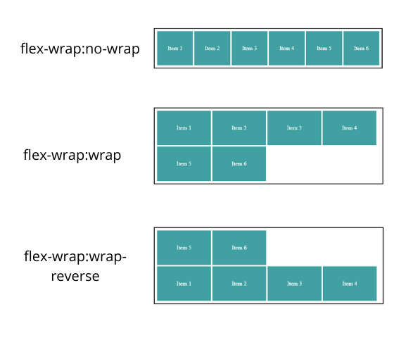
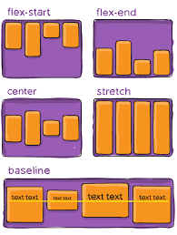
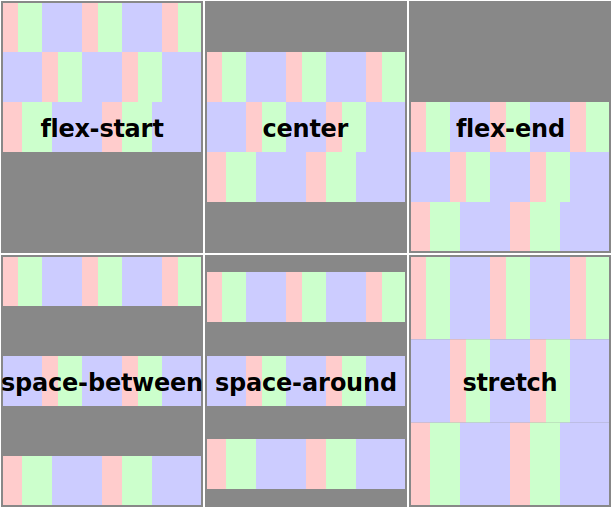
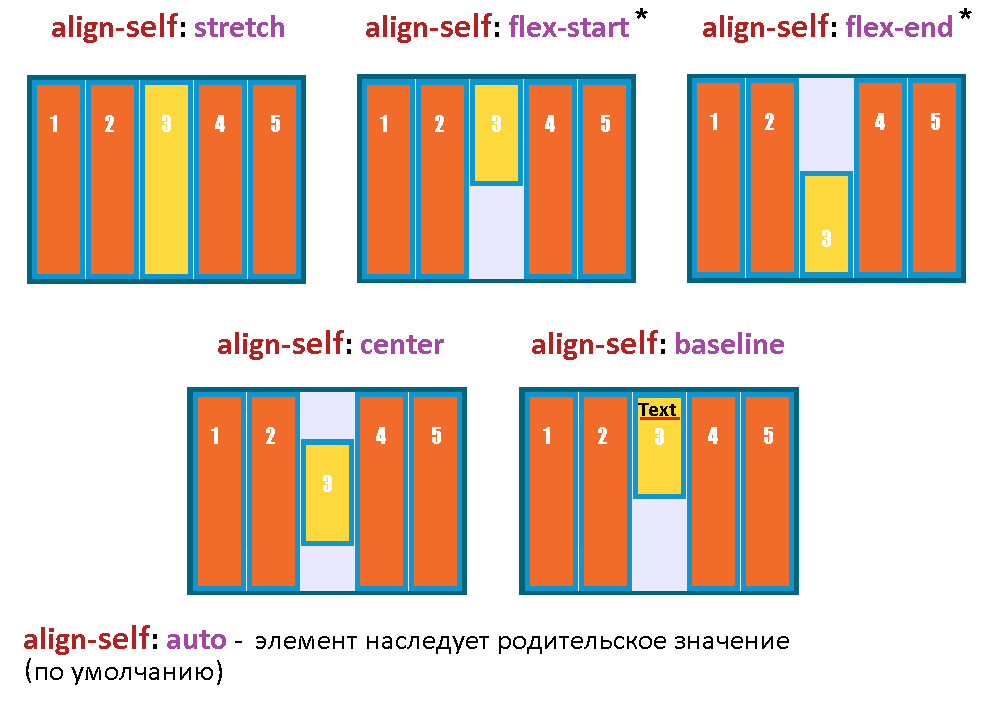

# Chapter 5 Continued Flexbox

### styling the form

- the form has the class login-form so use it to target the CSS

```html
<style>
  .login-form h3 {
    margin: 0;
    font-size: 0.9em;
    font-weight: bold;
    text-align: right;
    /* preferred over capitalizing in HTML as style decision */
    text-transform: uppercase;
  }

  .login-form input:not([type='checkbox']):not([type='radio']) {
    display: block;
    width: 100%;
    margin-top: 0;
  }

  .login-form button {
    margin-top: 1em;
    border: 1px solid #cc6b5a;
    background-color: white;
    /* more vertical than horizontal spacing aesthetically pleasing */
    padding: 0.5em 1em;
    cursor: pointer; /* hand with pointing finger mouse cursor */
  }
</style>
<div class="tile">
  <form class="login-form">
    <!-- 1st part title -->
    <h3>Login</h3>
    <!-- 2nd part input fields -->
    <p>
      <label for="username">Username</label>
      <input id="username" type="text" name="username" />
    </p>
    <p>
      <label for="password">Password</label>
      <input id="password" type="password" name="password" />
    </p>
    <!-- 3rd part button -->
    <button type="submit">Login</button>
  </form>
</div>
```

---

## HTML Input Elements

- HTML Input Elements are peculiar in CSS

```css
/* not pseudo-class wth attribute selector */
.login-form input:not([type='checkbox']):not([type='radio']) {
  display: block; /* so input elements displayed on own line */
  width: 100%;
  margin-top: 0; /* remove lobotomized owl */
}
```

### input:not([type='checkbox']):not([type='radio'])

- blacklist approach styling all input elements that are not checkboxes or radio buttons
- whitelist approach of listing all input elements would be lengthy
- although the form only uses text and password inputs should consider future changes

### display: block and width:100%

- although block (display: block) elements normally fill available width
  - input elements width is determined by size attribute

input element size attribute
: number of characters it should contain without scrolling, has default size value but and override by specifying width

- Example #12

---

## all properties for flexbox

- when working with flexbox:

1. use display: flex to specify the container
2. use flex-direction if needed
3. use margins and/or flex values for the flex items for size
4. use additional properties for flexbox (occasionally needed)

### all flex container properties

#### flex-direction


- specifies the direction of the main axis, the cross axis will be perpendicular

| flex-direction      |
| ------------------- |
| row (initial value) |
| column              |
| row-reverse         |
| column-reverse      |

#### flex-wrap



- wrap flex items to a new row for flex-direction row (or row-reverse)
- wrap flex items to a new column for flex-direction column (or column-reverse)

| flex-wrap               |                                        |
| ----------------------- | -------------------------------------- |
| no-wrap (initial value) | flex container's align-content ignored |
| wrap                    | flex item's flex-shrink value ignored  |
| wrap-reverse            | flex item's flex-shrink value ignored  |

- instead of using flex item's flex-shrink value wraps the flex item to the next row or column

- with flex-direction: column (or column-reverse)
  - flex-wrap will allow the flex items to overflow into a new column
  - however: only if something constrains height of flex container, otherwise the flex container will grow to contain its flex items

#### flex-flow

- flex-flow is a shorthand for flex-direction flex-wrap

```css
.flex-item {
  /* will wrap if something constrains the height of the container */
  flex-flow: column wrap;
}

/* equivalent to */
.flex-item {
  flex-direction: column;
  /* will wrap if something constrains the height of the container */
  flex-wrap: wrap;
}
```

#### justify-content


- how flex items are spaced along the main axis if they don't fill the size of the container
- spacing applied after margins and flex-grow values are calculated
- therefore justify-content will have no effect when:
  - any flex items have a flow-grow value other than 0
  - any items have auto margin on the main axis

##### justify-content values

| justify-content            |
| -------------------------- |
| flex-start (initial value) |
| flex-end                   |
| center                     |
| space-between              |
| space-around               |
| space-evenly               |

**flex-start (initial value)**
: flex items at beginning of main axis with no space between them unless margins specified

**space-between**
: 1st flex item at beginning of main axis and last at end, remaining items are positioned evenly between them

**space-around**
: like space-between but also adds even spacing before the 1st and after the last

#### align-items



- how flex items are spaced along the cross axis

| align-items             |
| ----------------------- |
| flex-start              |
| flex-end                |
| center                  |
| stretch (initial value) |
| baseline                |

stretch (initial value)
: all flex items will fill the height of the flex container or the width if flex-direction of column (column-reverse)

flex-start
: flex items along the start of the cross axis (top of a row)

flex-end
: flex items along the end of the cross axis (bottom of a row)

baseline
: aligns the flex items so that the baseline of their text aligns

- useful when want to align a large title with the text of a subtitle

#### align-content



- analogous to justify-content except for wrapped content along the cross axis
- only works when wrap (or wrap-reverse) specified

| align-content           |
| ----------------------- |
| flex-start              |
| flex-end                |
| center                  |
| stretch (initial value) |
| space-between           |
| space-around            |

### all flex items properties

#### flex-grow

- integer "growth factor", how much flex item will grow along the main axis to fill remaining spacing

#### flex-shrink

- integer "shrink factor", how much flex item will shrink along the main axis to prevent overflow
- wil not be used if flex-wrap is set on flex container

#### flex-basis

- initial size of the item before flex-grow or flex-shrink is applied

#### flex

- flex is a shorthand for flex-grow flex-shrink flex-basis

```css
.flex-item {
  flex: 1;
}

/* equivalent to */
.flex-item {
  flex-grow: 1;
  flex-shrink: 1;
  flex-basis: 0%;
}
```

#### align-self



- same as align-items except with ability to specify how flex items are spaced along the cross axis individually

- ignored if the flex item has margin auto set on the cross axis
  - ex. for flex-direction row this would be margin-top: auto, margin-bottom: auto as the cross axis is vertical

| align-self           |                                                  |
| -------------------- | ------------------------------------------------ |
| auto (initial value) | defers to the flex-container's align-items value |
| flex-start           |                                                  |
| flex-end             |                                                  |
| center               |                                                  |
| stretch              |                                                  |
| baseline             |                                                  |

#### order

| order             |                                            |
| ----------------- | ------------------------------------------ |
| 0 (initial value) | flex item laid out in order of HTML source |
| negative integer  | flex item moved to beginning               |
| positive integer  | flex item moved to end                     |

- **_WARNING_** tab order in browser and screen readers may still read out the flex items in HTML source order

---

## Example using additional HTML properties

```html
<style>
  .centered {
    text-align: center;
  }

  .cost {
    display: flex; /* flex container */
    justify-content: center; /* all flex items centered on main axis */
    align-items: center; /* all flex items centered on cross axis */
    /* flex items are inline so line-height and font-size determines height */
    /* 0.7 derived by trial and error so tops of 20 and .00 aligned visually */
    line-height: 0.7;
  }

  /* direct descendant combinator, the 3 spans */
  .cost > span {
    margin-top: 0; /* removal of body lobotomized owl */
  }

  /* set font sizes for each flex item */
  .cost-currency {
    font-size: 2rem;
  }

  .cost-dollars {
    font-size: 4rem;
  }

  .cost-cents {
    font-size: 1.5rem;
    align-self: flex-start; /* moves to the top of the flex container */
  }

  /* call to action button */
  .cta-button {
    display: block;
    background-color: #cc6b5a;
    color: white;
    padding: 0.5em 1em; /* more padding horizontally than vertically */
    text-decoration: none;
  }
</style>
<div class="tile centered">
  <small>Starting at</small>
  <div class="cost">
    <span class="cost-currency">$</span>
    <span class="cost-dollars">20</span>
    <span class="cost-cents">.00</span>
  </div>
  <a class="cta-button" href="/pricing">Sign Up</a>
</div>
```

- Example #13

---

## Flex bugs

- implementation of flexbox isn't perfect in all browsers especially IE 10 and 11 flexbugs repo has the issues and how to fix for older browsers
- [Flexbugs](https://github.com/philipwalton/flexbugs)

---

## Full-page layout

- one issue 3 columns (flex-direction: row), as browser progressively loads data it could render 2 columns first and then when full site loads recalculate and display the 3 column layout
- **_RECOMMEND_** using CSS grid instead of flexbox for full page layout

---
