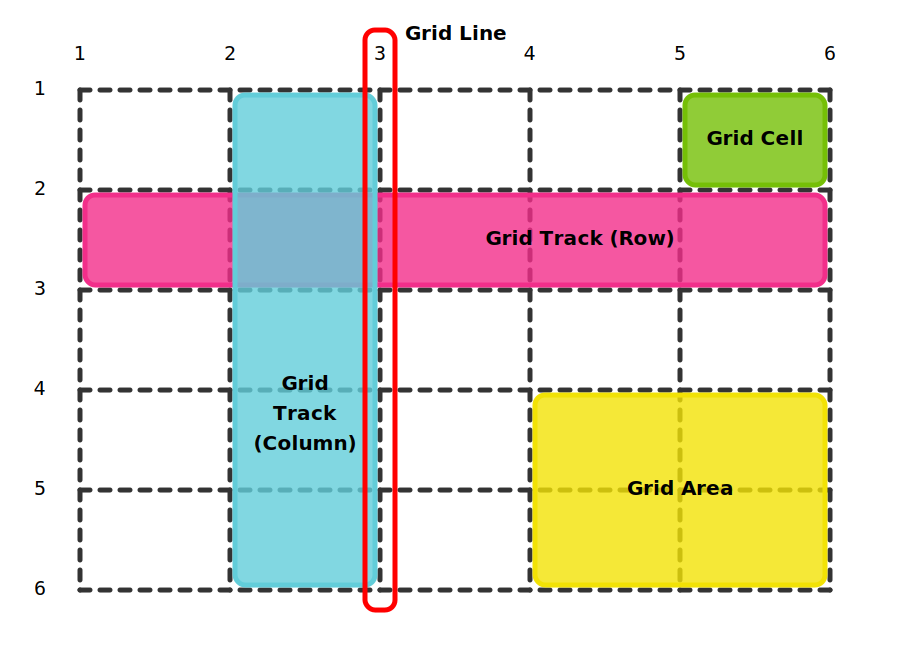
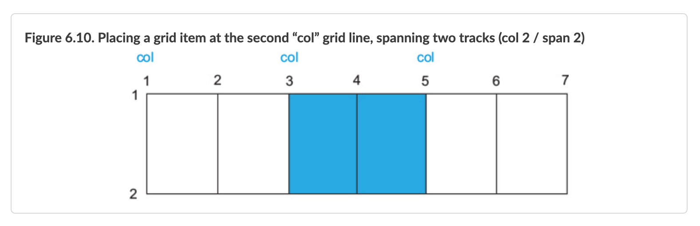

# Chapter 6 Grid Layout Module Continued

---

## use Flexbox for the other items on the page

- use grid when CSS alignment calls for 2 dimensions
- use flexbox when only concerned with one-directional flow
- **_Generally_** use grid for high-level page layout and flexbox for elements within each grid area
- Example #5

---



## alternative syntaxes

- in some designs syntax may be easier to read and understand named vs numbered lines

### named grid lines

```css
/* 2 columns with 3 named vertical grid lines start, center, and end */
.container {
  display: grid;
  grid-template-columns: [start] 2fr [center] 1fr [end];
}

/* header grid item that spans from grid line 1 (start) to grid line 3 (end) */
header {
  grid-column: start / end;
}
```

### named grid area

- naming grid lines left-start and left-end defined an area called left that spans between them

```css
.container {
  display: grid;
  /* 2 columns with 3 vertical grid lines left-start, left-end right-start, right-end */
  grid-template-columns: [left-start] 2fr [left-end right-start] 1fr [right-end];
  /* 4 horizontal grid tracks of size auto */
  /* longhand form would be [row] auto [row] auto [row] auto [row] auto */
  /* so each grid row line is named except for the last one */
  grid-template-rows: repeat(4, [row] auto);
  gap: 1.5em;
  /* double-container to center page contents */
  max-width: 1080px;
  margin: 0 auto;
}

header,
nav {
  grid-column: left-start / right-end;
  /* using placement algorithm (auto-placement) to position item
  to fill the first available space on the grid where they fit */
  grid-row: span 1;
}

.main {
  /* a named area, spans between left-start and left-end */
  grid-column: left;
  /* 3rd grid line named row then spans 2 horizontal grid tracks */
  grid-row: row 3 / span 2;
}

.sidebar-top {
  /* grid column right area between right-start and right-end */
  grid-column: right;
  grid-row: 3 / 4;
}

.sidebar-bottom {
  /* grid column right area between right-start and right-end */
  grid-column: right;
  grid-row: 4 / 5;
}
```

- Example #6

---

## using named grid lines



```css
.grid-container {
  display: grid;
  /* long hand would be [col] 1fr 1fr [col] 1fr 1fr [col] 1fr 1fr */
  grid-template-columns: repeat(3, [col] 1fr 1fr);
}

.grid-item {
  /* starting with the 2nd named col line spanning 2 columns */
  grid-column: col 2 / span 2;
}
```

---

## named grid areas

- can use named areas to position items in a grid
- the areas much form a rectangle

```css
.container {
  display: grid;
  /* draw a visual representation of the grid "ASCII art" syntax */
  grid-template-areas:
    'title title'
    'nav nav'
    'main aside1'
    'main aside2';
  /* define the track sizes as before */
  grid-template-columns: 2fr 1fr;
  grid-template-rows: repeat(4, auto);
  gap: 1.5em;
  /* double-container */
  max-width: 1080px;
  margin: 0 auto;
}

header {
  /* grid item in title grid area */
  grid-area: title;
}

nav {
  /* grid item in nav grid area */
  grid-area: nav;
}

.main {
  /* grid item in main grid area */
  grid-area: main;
}

.sidebar-top {
  /* grid item in aside1 grid area */
  grid-area: aside1;
}

.sidebar-bottom {
  /* grid item in aside2 grid area */
  grid-area: aside2;
}
```

- Example #7

### named grid areas with spaces

- can leave an cell empty by using a period as its name

```css
.grid-container {
  display: grid;
  grid-template-areas:
    'top  top    right'
    'left .      right'
    'left bottom bottom';
  grid-template-columns: 2fr 1fr 1fr;
  grid-template-rows: repeat(3, auto);
}
```

---

## implicit grid

- use when don't exactly know where want to place each item
  - a lot of grid items
  - unknown # of items
- loosely define a grid and let grid item placement algorithm fill it

explicit tracks
: defined by grid-template-columns and grid-template-rows

implicit tracks
: created when grid items placed outside the explicit tracks automatically expanding the grid

### implicit grid tracks

- by default auto so will grow to size necessary to contain contents

grid-auto-columns
: size of implicit columns (default auto)

grid-auto-rows
: size of implicit rows (default auto)

### implicit grid example

minmax
: to constrain between minimum and maximum values instead of setting fixed size on grid track

auto-fill
: used with repeat function to fill as many tracks onto the grid as can fit without violating restrictions set by the specified size

auto-fit
: as auto-fill leave empty grid tracks if not enough grid items to fit them all, auto-fit will stretch the non-empty tracks to fill the available space

- **_RECOMMEND_** auto-fit

```html
<style>
  body {
    background-color: #709b90;
    font-family: Helvetica, Arial, sans-serif;
  }

  .portfolio {
    display: grid;
    /* fit as many vertical grid tracks (grid columns) as can */
    /* without any of the columns being less than 200px */
    grid-template-columns: repeat(auto-fill, minmax(200px, 1fr));
    /* implicit horizontal grid tracks (grid rows) of 1fr */
    grid-auto-rows: 1fr;
    gap: 1em;
  }

  .portfolio > figure {
    /* override user agent margins */
    margin: 0;
  }

  .portfolio img {
    max-width: 100%;
  }

  .portfolio figcaption {
    padding: 0.3em 0.8em;
    background-color: rgba(0, 0, 0, 0.5);
    color: #fff;
    text-align: right;
  }
</style>
<!-- grid container -->
<div class="portfolio">
  <!-- each figure a grid item -->
  <figure class="featured">
    <!-- as the alt is redundant to the figcaption should be empty  -->
    
    <figcaption>Monkey</figcaption>
  </figure>
  <figure>
    
    <figcaption>Eagle</figcaption>
  </figure>
  <figure class="featured">
    
    <figcaption>Bird</figcaption>
  </figure>
  <figure>
    
    <figcaption>Bear</figcaption>
  </figure>
  <figure class="featured">
    
    <figcaption>Swan</figcaption>
  </figure>
  <figure>
    
    <figcaption>Elephants</figcaption>
  </figure>
  <figure>
    
    <figcaption>Owl</figcaption>
  </figure>
</div>
```

---
